# Architecture Diagrams

---

## 1. Portfolio Website — clarkfoster.com

### 1.1 High-Level Architecture

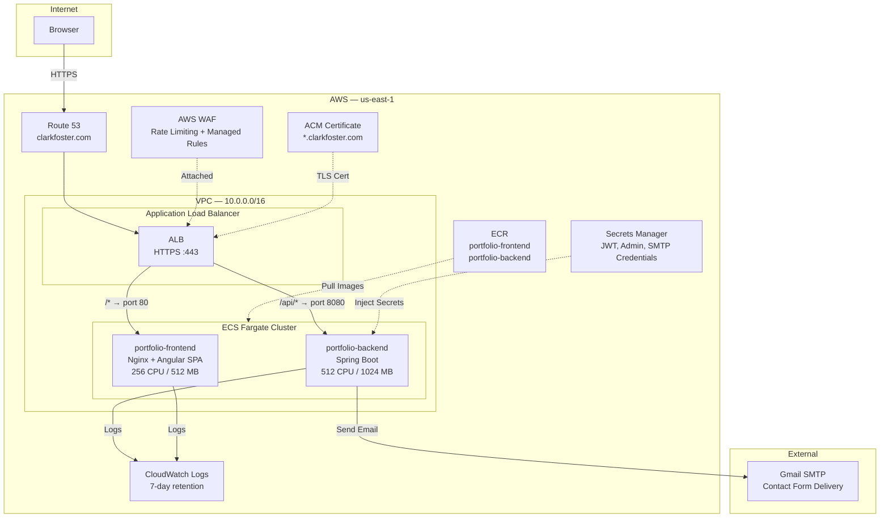

### 1.2 Component Diagram

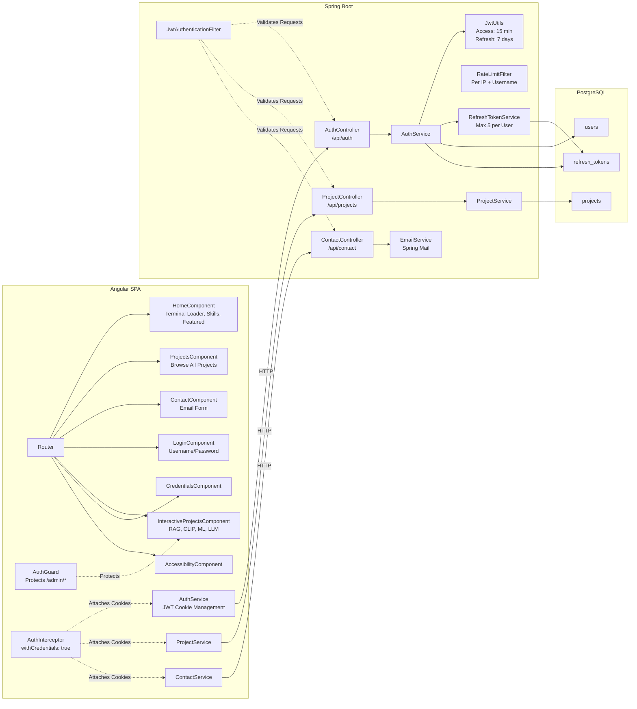

### 1.3 Data Flow Diagram

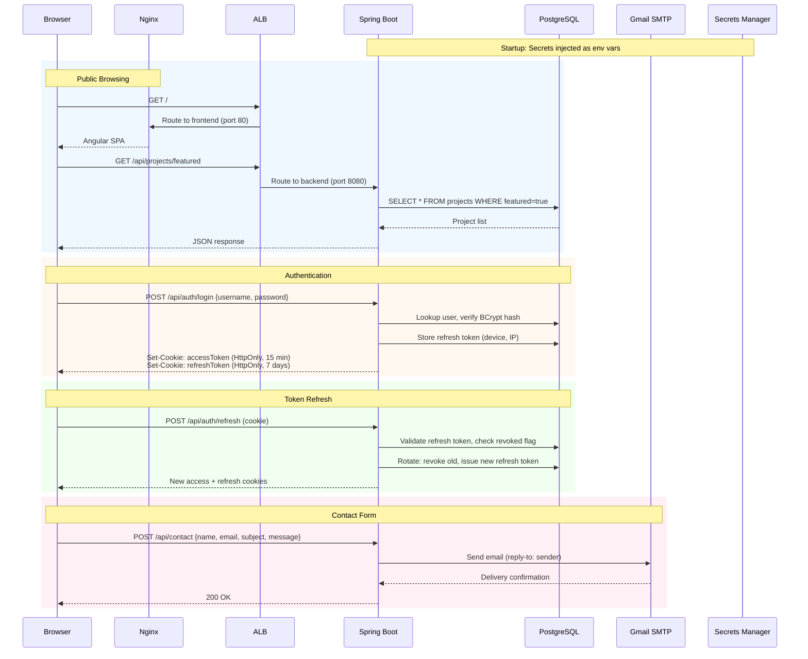

### 1.4 Component Explanations

| Component | Purpose |
|-----------|---------|
| **Nginx** | Serves the compiled Angular SPA. Adds security headers (HSTS, CSP, X-Frame-Options). Handles SPA fallback routing via `try_files`. Rate-limits requests at the protocol level. |
| **Angular SPA** | Single-page application with standalone components. Lazy-loads interactive project routes. Manages JWT lifecycle via interceptors and guards. |
| **Spring Boot API** | Stateless REST backend. Handles authentication, project CRUD, and contact form submission. JWT filter chain validates every request. |
| **PostgreSQL** | Stores users, projects, and refresh tokens. Runs as H2 in-memory for local development, PostgreSQL in production. |
| **Secrets Manager** | Injects sensitive configuration (JWT signing key, admin credentials, SMTP password) into the container at task startup. Avoids hardcoded secrets in images or task definitions. |
| **Gmail SMTP** | External email relay for contact form submissions. Configured via Spring Mail with injected credentials. |
| **RefreshTokenService** | Enforces a maximum of 5 active refresh tokens per user. Tracks device (user agent) and IP address per session. Supports single-device and all-device logout. |

### 1.5 Architecture Rationale

**Why this architecture:**

The portfolio is a low-traffic, content-driven site. A single Spring Boot backend with an embedded JWT auth system keeps deployment simple — one backend container, no external auth provider dependency. PostgreSQL stores minimal data (users, projects, refresh tokens), so a managed database would be over-provisioned. The frontend is a static Angular build served by Nginx, which also handles TLS termination at the edge (ALB) and adds security headers.

**Key tradeoffs:**

| Decision | Benefit | Cost |
|----------|---------|------|
| JWT with refresh tokens vs. session-based auth | Stateless backend, no session store needed | Token revocation requires database lookup on refresh; can't instantly revoke access tokens |
| Spring Mail (Gmail SMTP) vs. SES | Zero AWS cost for low-volume email, simpler config | Gmail rate limits (500/day), requires app password management |
| H2 for dev / PostgreSQL for prod | Fast local iteration, no local DB setup needed | Schema drift risk — mitigated by `ddl-auto=update` |
| No CDN (CloudFront) | Fewer moving parts, lower cost | Higher latency for geographically distant users |
| Sidecar-less backend (no DB container) | Smaller task footprint (512 CPU / 1024 MB) | Portfolio uses H2 in dev; in prod, the data set is small enough that an embedded approach was considered but PostgreSQL was chosen for durability |

---

## 2. E-Commerce Platform — shop.clarkfoster.com

### 2.1 High-Level Architecture

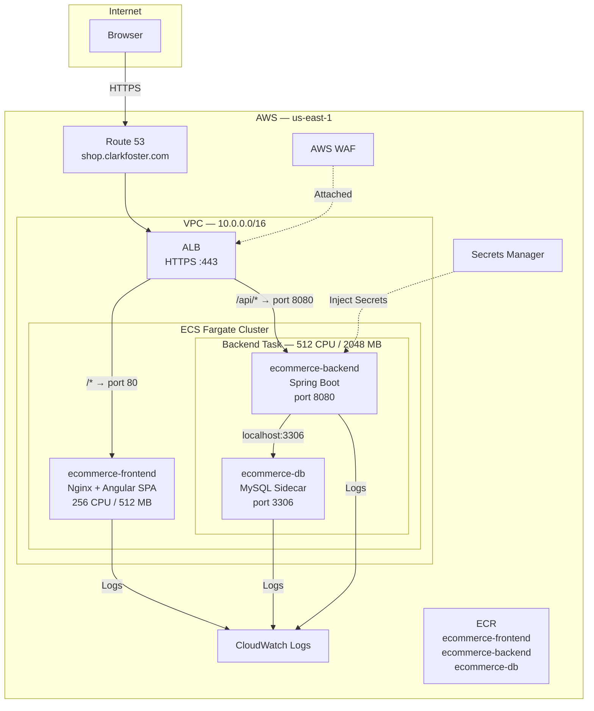

### 2.2 Component Diagram

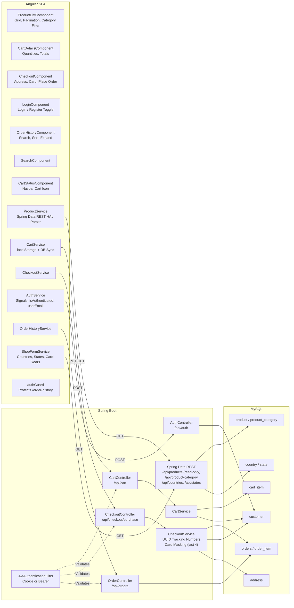

### 2.3 Data Flow Diagram

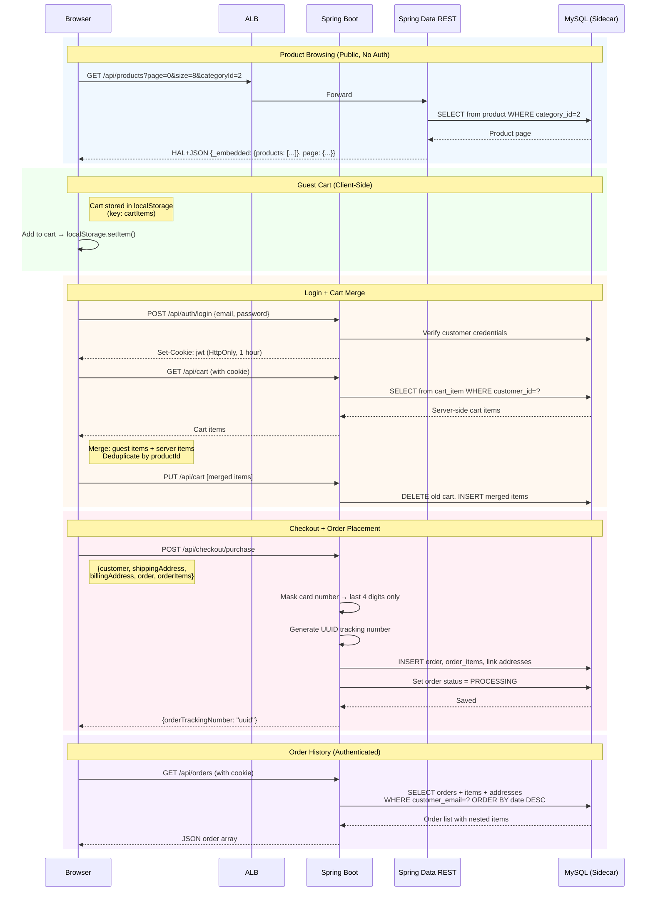

### 2.4 Component Explanations

| Component | Purpose |
|-----------|---------|
| **Spring Data REST** | Auto-generates paginated, filterable, read-only REST endpoints for the product catalog, categories, countries, and states from JPA repository interfaces. Eliminates boilerplate controller code for the read path. Write operations are disabled via `MyDataRestConfig`. |
| **CartService (frontend)** | Manages dual-storage cart: `localStorage` for guests, database for authenticated users. On login, fetches the server-side cart, merges it with local guest items (deduplicating by productId), and persists the merged result. On logout, saves current cart to server before clearing local state. |
| **CheckoutService (backend)** | Converts the `Purchase` DTO into persisted entities. Masks credit card numbers to last 4 digits before writing to the database. Generates a UUID-based order tracking number. Links order to the authenticated customer or the form-submitted customer info for guest checkout. |
| **MySQL Sidecar** | Runs as a second container inside the same ECS task (shared `awsvpc` network mode). Communicates with the backend via `localhost:3306`. Health-checked via `mysqladmin ping` with a 30-second start period. Initialized from a schema script on first boot. |
| **JwtAuthenticationFilter** | Extracts JWT from HTTP-only cookie first, falls back to `Authorization: Bearer` header. Handles stale cookies gracefully — if the user was deleted from the database, the request proceeds as unauthenticated rather than returning a 500. |

### 2.5 Architecture Rationale

**Why this architecture:**

The e-commerce platform needs a relational data model (products, orders, customers, addresses with strict referential integrity) and both read-heavy public browsing and write-heavy authenticated operations. Spring Data REST handles the read path with zero controller code, while explicit controllers handle writes with business logic (card masking, order tracking, cart merge). The sidecar database pattern keeps the backend and database co-located in the same task, avoiding cross-network latency and the cost of a managed RDS instance.

**Key tradeoffs:**

| Decision | Benefit | Cost |
|----------|---------|------|
| Spring Data REST for catalog vs. custom controllers | Auto-generates paginated, filterable, HAL-compliant endpoints from repository interfaces | Less control over response shape; frontend must parse HAL `_embedded` format |
| MySQL sidecar vs. RDS | No RDS cost (~$15+/month for db.t3.micro). Simpler task-level deployment. | No managed backups, no multi-AZ failover, no point-in-time recovery. Data loss if the task is replaced. Acceptable for a demonstration project. |
| Card masking (last 4 digits) with no payment gateway | Demonstrates PCI-aware handling without payment processor integration costs | Cannot process real payments without adding Stripe/PayPal |
| Guest cart in localStorage + server merge on login | Users can browse and add items without creating an account | Merge logic adds frontend complexity; edge cases around duplicate products |
| JWT in HTTP-only cookie vs. localStorage | XSS protection — JavaScript cannot access the token | Requires `withCredentials: true` on all HTTP calls; CORS must be explicitly configured |

---

## 3. HireFlow (ATS) — ats.clarkfoster.com

### 3.1 High-Level Architecture

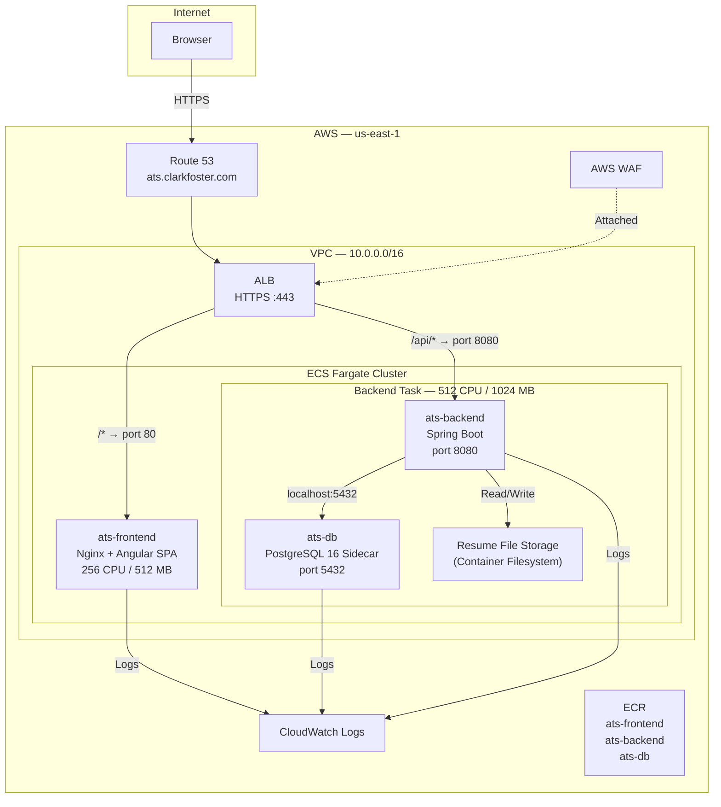

### 3.2 Component Diagram

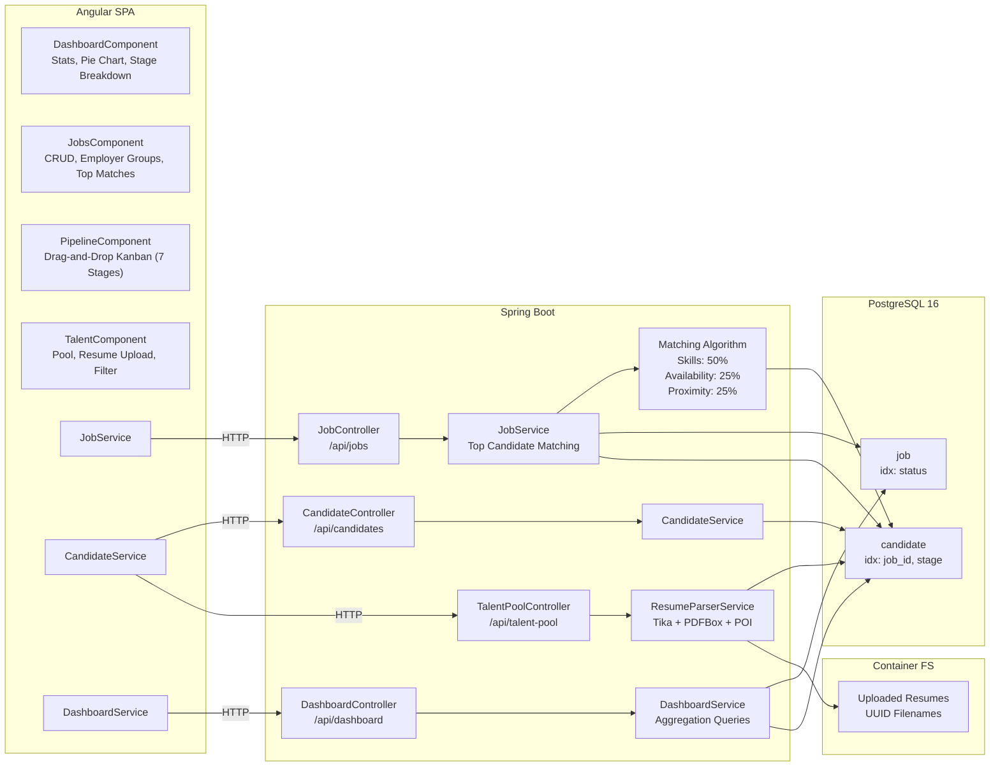

### 3.3 Data Flow Diagram

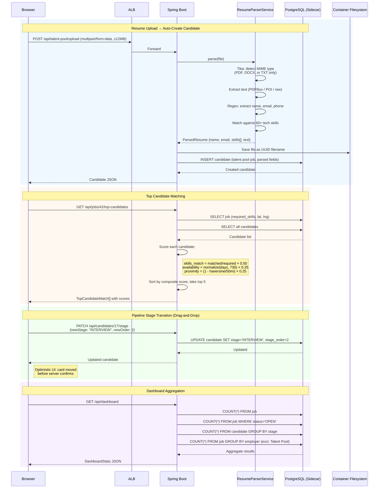

### 3.4 Component Explanations

| Component | Purpose |
|-----------|---------|
| **PipelineComponent** | Drag-and-drop Kanban board using Angular CDK `DragDropModule`. Displays candidates across 7 columns (APPLIED through HIRED/REJECTED). Performs optimistic UI updates — the card moves immediately and rolls back if the API call fails. |
| **ResumeParserService** | Accepts PDF, DOCX, and TXT uploads. Uses Apache Tika for MIME type detection (rejects other file types). Extracts text via PDFBox (PDF) or Apache POI (DOCX). Applies regex patterns to extract name, email, and phone. Matches extracted text against a curated list of 60+ technical skills. Creates a candidate record in the talent pool with all parsed fields. |
| **Matching Algorithm** | Composite scoring system for ranking candidates against a job. Three weighted factors: skill overlap (50%), availability based on recency of last assignment (25%), and geographic proximity via Haversine formula (25%). Proximity caps at 50 miles — candidates beyond that distance score zero on that factor. Returns top 5 matches. |
| **PostgreSQL Sidecar** | Runs as a second container in the same Fargate task. Health-checked via `pg_isready`. Seeded on first boot with 6 jobs and 100 candidates for immediate demonstration. Indexed on `job_id`, `stage`, and `status` for query performance. |
| **Container Filesystem (Resume Storage)** | Uploaded resumes are stored on the container's local filesystem with UUID-based filenames to prevent path traversal. Files are served back via `GET /api/talent-pool/resumes/{filename}` with a strict filename regex. Ephemeral — files are lost if the task is replaced. |
| **TalentComponent** | Central talent pool UI with debounced search (300ms), multi-select skill filter tags, and pagination (12 per page). Supports resume upload via a modal dialog. Displays candidate cards with skills, contact info, and notes. |

### 3.5 Architecture Rationale

**Why this architecture:**

An ATS is inherently relational — jobs have candidates, candidates have stages, and matching requires joins across both tables. PostgreSQL handles this well and provides geographic functions that support the proximity calculation. The sidecar pattern keeps the database on the same network namespace as the backend, so `localhost:5432` has zero network overhead. The resume parser runs in-process (Tika, PDFBox, POI) rather than calling an external NLP service, keeping the system self-contained.

**Key tradeoffs:**

| Decision | Benefit | Cost |
|----------|---------|------|
| Sidecar PostgreSQL vs. RDS | No RDS cost, simpler deployment, localhost latency | No managed backups or failover. Data is ephemeral — tied to the task lifecycle. Acceptable for demo seeded data. |
| In-process resume parsing (Tika/PDFBox/POI) vs. external service | No external dependencies, no API costs, deterministic behavior | Limited extraction quality — regex-based name/email parsing is brittle for non-standard resume formats. No OCR for scanned PDFs. |
| Container filesystem for resume storage vs. S3 | Simple implementation, no S3 costs or IAM policies | Files lost on task replacement. Would need S3 for production durability. |
| Haversine distance for proximity vs. geocoding API | No external API calls, no rate limits, deterministic | Requires lat/lng to be pre-populated on both jobs and candidates. Straight-line distance, not driving distance. |
| No authentication (demo mode) vs. full auth | Faster to demonstrate, no login friction | Not production-safe. Any user can modify any data. Acceptable for a portfolio demonstration. |
| Optimistic UI for drag-and-drop vs. wait for server | Immediate visual feedback, snappier UX | Must handle rollback on failure; risk of brief inconsistent state if API errors |

---

## 4. Shared Cloud Infrastructure

### 4.1 High-Level Architecture

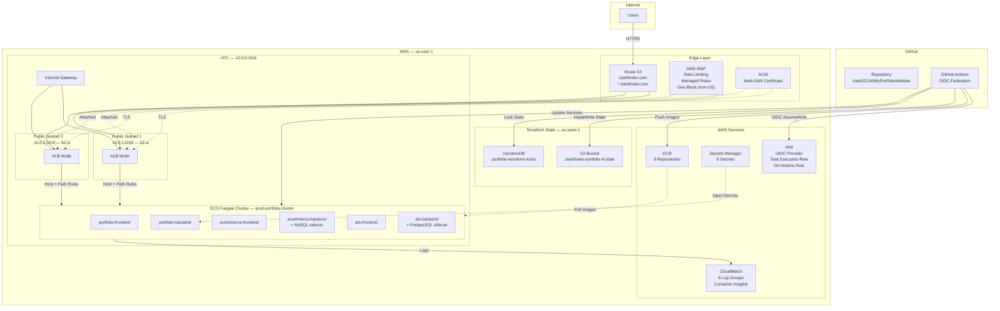

### 4.2 Component Diagram — Networking & Security

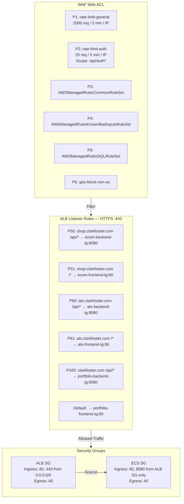

### 4.3 Data Flow Diagram — CI/CD Deployment Pipeline

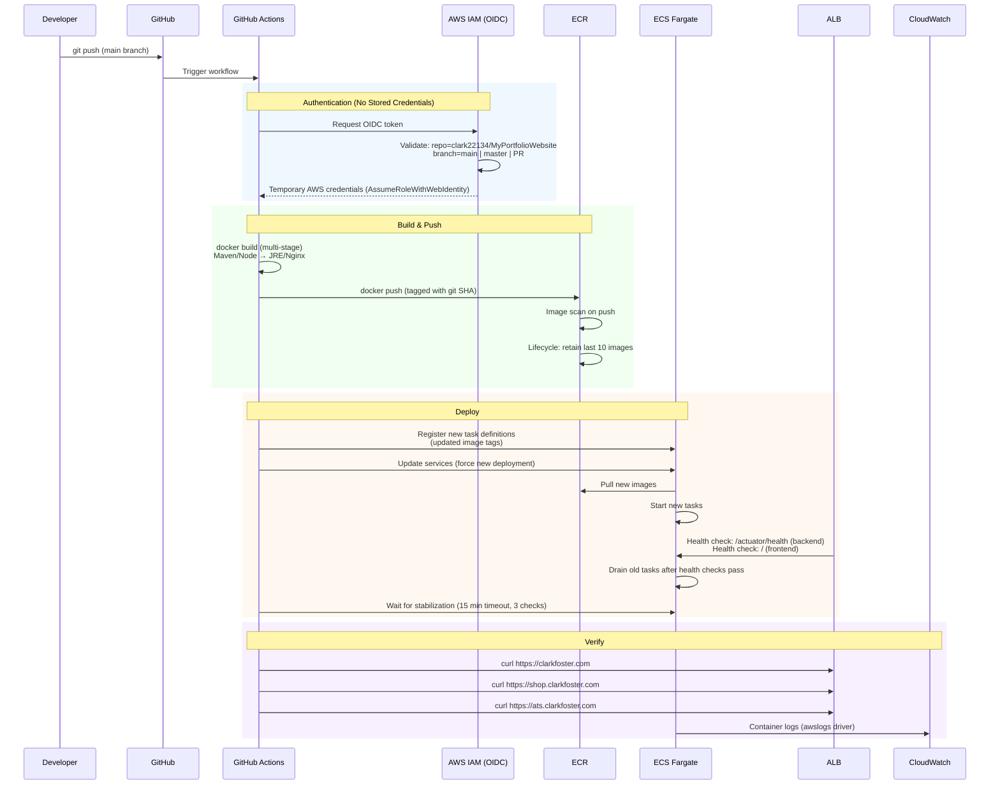

### 4.4 Data Flow Diagram — Request Path (End-to-End)

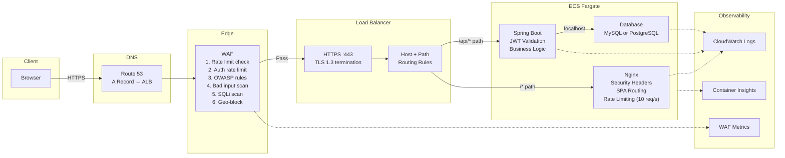

### 4.5 Component Explanations

| Component | Purpose |
|-----------|---------|
| **Route 53** | DNS resolution for all four hostnames (apex, www, shop, ats). Alias records point directly to the ALB, avoiding an extra CNAME hop. |
| **AWS WAF** | First line of defense. Six rules in priority order: general rate limiting, auth-specific rate limiting, three AWS managed rule sets (OWASP common, known bad inputs, SQLi), and a geo-block for non-US traffic. All rules emit CloudWatch metrics. |
| **ACM Certificate** | Single certificate with four SANs (clarkfoster.com, www, shop, ats). DNS-validated via Route 53 records. Uses create-before-destroy lifecycle to avoid downtime during renewal. |
| **ALB** | Layer 7 load balancer performing host-based and path-based routing. TLS 1.3 termination. HTTP listener redirects all traffic to HTTPS. Cross-zone load balancing across two availability zones. Six target groups (3 frontends on port 80, 3 backends on port 8080). |
| **ECS Fargate** | Serverless container runtime. Six services, each running one task (desired count: 1). No EC2 instances to manage. Backend tasks include sidecar database containers for e-commerce (MySQL) and ATS (PostgreSQL). Portfolio backend is stateless with no sidecar. |
| **ECR** | Container image registry with 8 repositories. Lifecycle policies keep only the 10 most recent images per repository to control storage costs. Images are scanned on push for known vulnerabilities. |
| **Secrets Manager** | Stores 8 secrets (JWT key, admin credentials, SMTP credentials). Injected into the portfolio backend task as environment variables at startup via the ECS task execution role. Other backends use environment variables defined in task definitions. |
| **CloudWatch** | Centralized logging for all 8 containers via the `awslogs` driver. 7-day retention balances troubleshooting access with storage cost. Container Insights provides cluster-level CPU, memory, and networking metrics. |
| **GitHub Actions (OIDC)** | CI/CD pipeline with keyless AWS authentication. The OIDC provider trusts the GitHub repository and branch. No long-lived AWS access keys are stored in GitHub. The IAM role grants permissions for ECR push, ECS service updates, Terraform state access, and infrastructure management. |
| **Terraform Remote State** | S3 bucket in eu-west-2 with versioning and AES256 encryption. DynamoDB table provides state locking to prevent concurrent Terraform runs. Bootstrap module creates these resources before the main configuration is applied. |

### 4.6 Architecture Rationale

**Why this architecture:**

A single ALB with host-based routing serves three applications from one load balancer, avoiding the cost of three separate ALBs (~$16/month each). ECS Fargate eliminates EC2 management overhead — no patching, no capacity planning, no idle costs. The sidecar database pattern avoids RDS charges while keeping each application's data co-located with its backend. Terraform codifies the entire stack, and GitHub Actions OIDC removes the need for stored AWS credentials.

**Key tradeoffs:**

| Decision | Benefit | Cost |
|----------|---------|------|
| Single ALB for 3 applications vs. one ALB per app | ~$32/month savings (2 fewer ALBs). Simpler DNS — all domains point to one endpoint. Single WAF attachment covers everything. | Shared blast radius — ALB misconfiguration or limit exhaustion affects all three apps. Listener rule management grows with each new app. |
| ECS Fargate vs. EC2-backed ECS | No server management, exact resource billing, automatic security patching of the underlying host. | Higher per-unit cost than reserved EC2 instances for sustained workloads. No SSH access for debugging — must rely on CloudWatch logs and exec. |
| Sidecar databases vs. RDS | Eliminates ~$30+/month in RDS costs. Simpler deployment — database is part of the task definition. | No managed backups, no failover, no point-in-time recovery. Database restarts with the task. Acceptable for demonstration projects with seeded data. |
| GitHub Actions OIDC vs. stored IAM access keys | No long-lived credentials to rotate or leak. Token scoped to specific repo and branch. | Slightly more complex IAM trust policy. Debugging OIDC failures is less intuitive than key-based auth. |
| Single VPC with public subnets only vs. public/private subnet layout | Simpler networking, fewer NAT Gateway costs ($32+/month). All containers get public IPs. | ECS tasks are directly reachable if security groups are misconfigured. A private subnet + NAT Gateway would add defense-in-depth. Mitigated by restricting ECS SG ingress to ALB SG only. |
| 7-day CloudWatch log retention vs. longer | Low storage cost. | Limited historical debugging. Acceptable for a portfolio site — production systems would use 30–90 days or archive to S3. |
| Geo-blocking non-US traffic via WAF | Reduces attack surface from regions without expected users. | Blocks legitimate international visitors (recruiters, peers). Can be toggled off if needed. |
| Terraform remote state in eu-west-2 vs. us-east-1 | Separates state from application infrastructure. Reduces risk of accidental deletion when working in us-east-1. | Cross-region latency on `terraform plan/apply` (minimal in practice). |
