# Architecture Diagrams

---

## 1. Portfolio Website — clarkfoster.com

### 1.1 High-Level Architecture

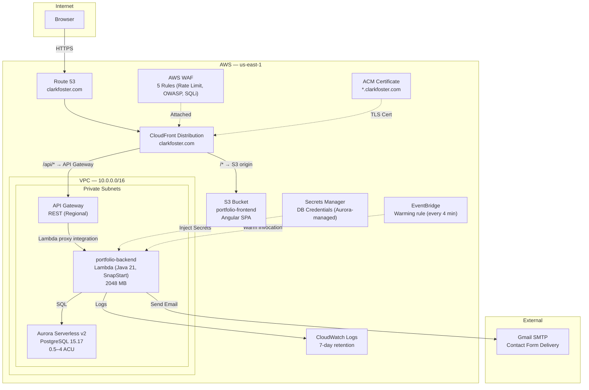

### 1.2 Component Diagram

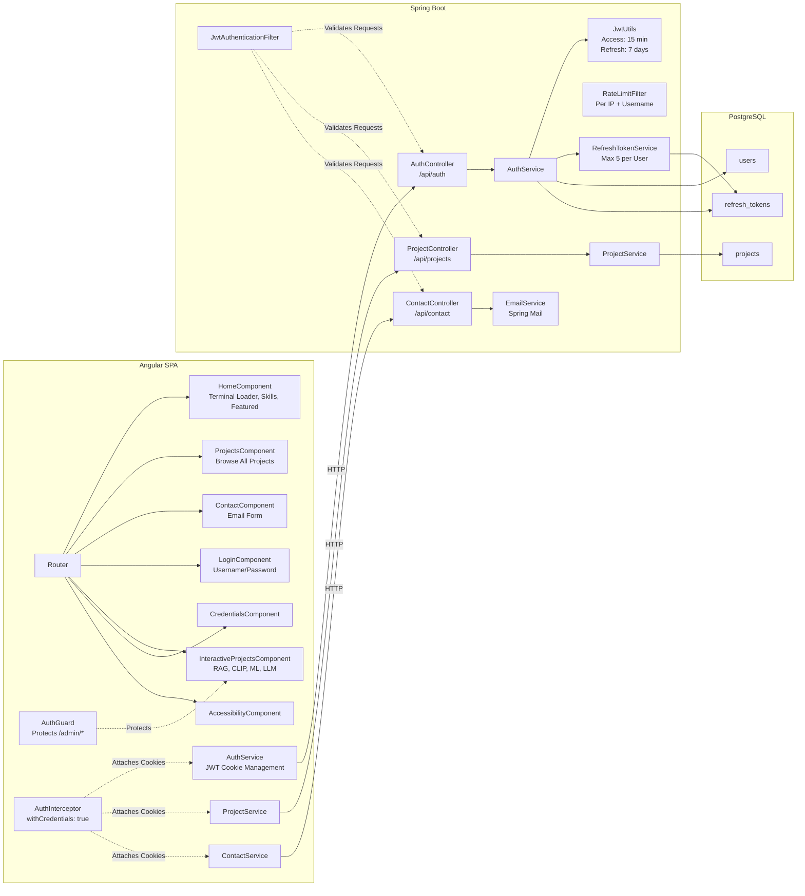

### 1.3 Data Flow Diagram

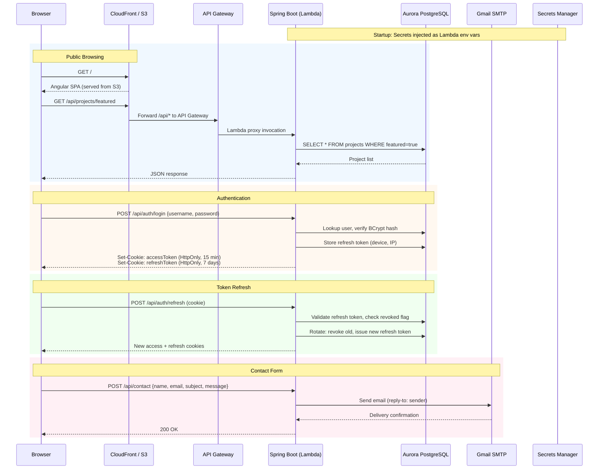

### 1.4 Component Explanations

| Component | Purpose |
|-----------|---------|
| **CloudFront** | Global CDN entry point. Routes `/*` to S3 origin (Angular SPA) and `/api/*` to API Gateway. Enforces TLS at edge locations. WAF attached at CloudFront layer. |
| **Angular SPA** | Single-page application with standalone components. Lazy-loads interactive project routes. Manages JWT lifecycle via interceptors and guards. Served as static files from S3. |
| **Spring Boot API (Lambda)** | Stateless REST backend packaged as a Lambda function using `aws-serverless-java-container-springboot3`. Handles authentication, project CRUD, and contact form submission. JWT filter chain validates every request. |
| **Aurora Serverless v2** | Managed PostgreSQL 15.17 database (0.5–4 ACU). Stores users, projects, and refresh tokens. Scales toward zero during idle periods; auto-scales ACU under load. |
| **Secrets Manager** | Aurora-managed database credentials stored in Secrets Manager and accessed by Lambda at runtime. JWT signing key, admin password, and SMTP credentials are passed as Terraform variables to Lambda environment variables — no application secrets stored in Secrets Manager. |
| **Gmail SMTP** | External email relay for contact form submissions. Configured via Spring Mail with injected credentials. |
| **RefreshTokenService** | Enforces a maximum of 5 active refresh tokens per user. Tracks device (user agent) and IP address per session. Supports single-device and all-device logout. |

### 1.5 Architecture Rationale

**Why this architecture:**

The portfolio is a low-traffic, content-driven site. A single Spring Boot backend packaged as a Lambda function keeps deployment simple — one function, no container orchestration. Aurora Serverless v2 provides a production-grade managed PostgreSQL database that scales near-zero during idle periods, avoiding both the cost of always-on RDS and the fragility of sidecar containers. The frontend is a static Angular build served from S3 via CloudFront, adding global CDN edge caching and TLS termination.

**Key tradeoffs:**

| Decision | Benefit | Cost |
|----------|---------|------|
| JWT with refresh tokens vs. session-based auth | Stateless backend, no session store needed | Token revocation requires database lookup on refresh; can't instantly revoke access tokens |
| Spring Mail (Gmail SMTP) vs. SES | Zero AWS cost for low-volume email, simpler config | Gmail rate limits (500/day), requires app password management |
| H2 for dev / Aurora PostgreSQL for prod | Fast local iteration, schema validation catches drift early | `ddl-auto=validate` in prod requires manual schema migration scripts |
| CloudFront CDN + S3 | Global low-latency SPA delivery, ~$1/month at portfolio traffic | S3 origin latency on cache miss; requires CloudFront invalidation on deploy |
| Lambda (serverless) vs. always-on container | Pay per request, no idle cost; auto-scales to thousands of concurrent users | Cold starts (mitigated by SnapStart + EventBridge warming); 15-min max execution time |

---

## 2. E-Commerce Platform — shop.clarkfoster.com

### 2.1 High-Level Architecture

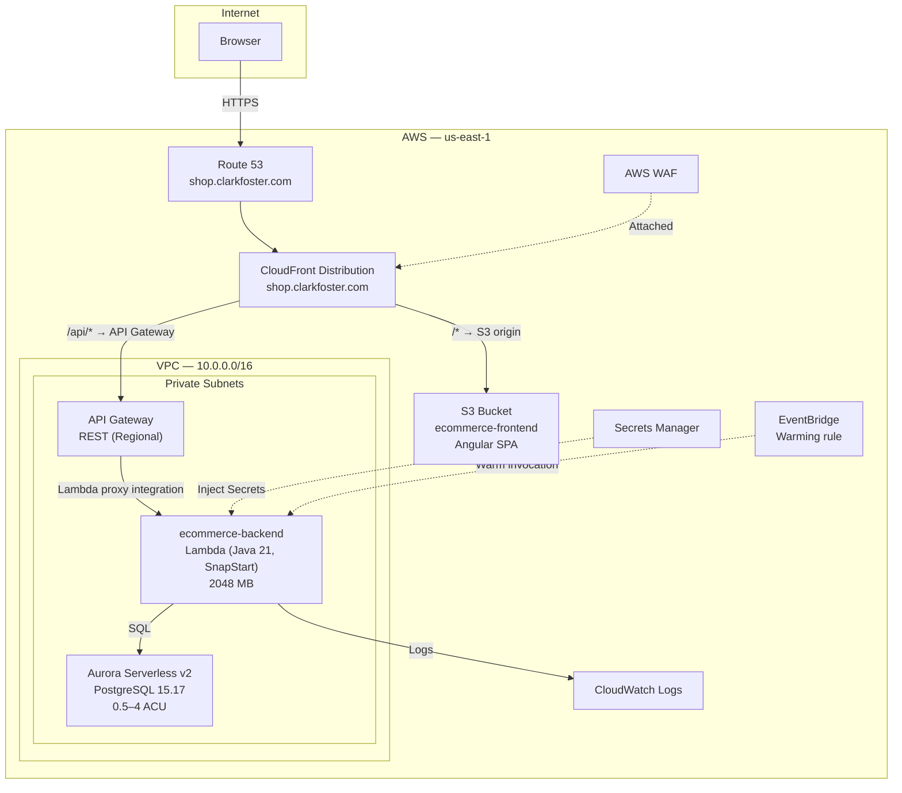

### 2.2 Component Diagram

### 2.3 Data Flow Diagram

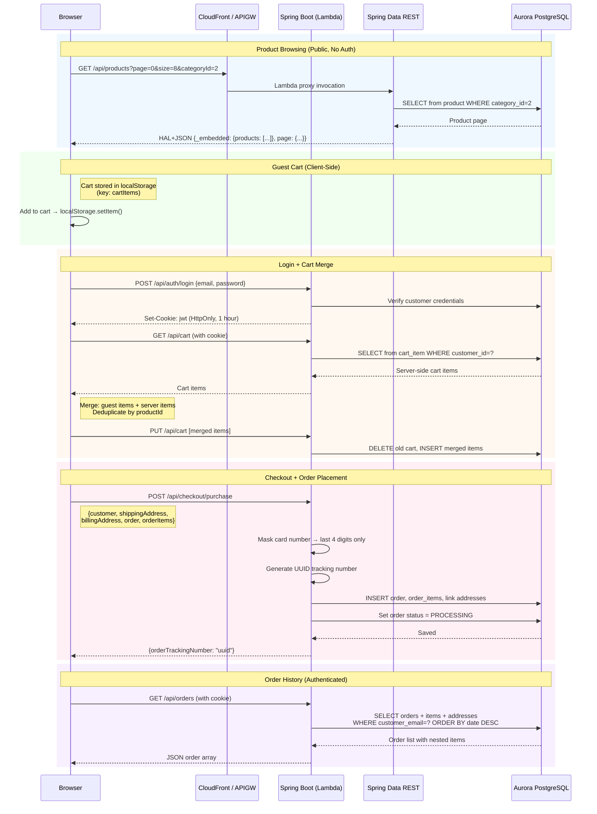

### 2.4 Component Explanations

| Component | Purpose |
|-----------|---------|
| **Spring Data REST** | Auto-generates paginated, filterable, read-only REST endpoints for the product catalog, categories, countries, and states from JPA repository interfaces. Eliminates boilerplate controller code for the read path. Write operations are disabled via `MyDataRestConfig`. |
| **CartService (frontend)** | Manages dual-storage cart: `localStorage` for guests, database for authenticated users. On login, fetches the server-side cart, merges it with local guest items (deduplicating by productId), and persists the merged result. On logout, saves current cart to server before clearing local state. |
| **CheckoutService (backend)** | Converts the `Purchase` DTO into persisted entities. Masks credit card numbers to last 4 digits before writing to the database. Generates a UUID-based order tracking number. Links order to the authenticated customer or the form-submitted customer info for guest checkout. |
| **Aurora Serverless v2** | Managed PostgreSQL 15.17 database (0.5–4 ACU) stores all relational data: products, customers, orders, cart items, addresses, countries, and states. Auto-scales ACU based on connection load. Automated backups and point-in-time recovery. |
| **JwtAuthenticationFilter** | Extracts JWT from HTTP-only cookie first, falls back to `Authorization: Bearer` header. Handles stale cookies gracefully — if the user was deleted from the database, the request proceeds as unauthenticated rather than returning a 500. |

### 2.5 Architecture Rationale

**Why this architecture:**

The e-commerce platform needs a relational data model (products, orders, customers, addresses with strict referential integrity) and both read-heavy public browsing and write-heavy authenticated operations. Spring Data REST handles the read path with zero controller code, while explicit controllers handle writes with business logic (card masking, order tracking, cart merge). Aurora Serverless v2 provides a production-grade managed PostgreSQL database with automated backups and point-in-time recovery, replacing ephemeral sidecar containers.

**Key tradeoffs:**

| Decision | Benefit | Cost |
|----------|---------|------|
| Spring Data REST for catalog vs. custom controllers | Auto-generates paginated, filterable, HAL-compliant endpoints from repository interfaces | Less control over response shape; frontend must parse HAL `_embedded` format |
| Aurora Serverless v2 vs. always-on RDS | Scales near-zero during idle, ~$8/month vs. $25+/month for db.t3.micro always-on | First query after Aurora idle period has 1–2 second reconnection delay |
| Card masking (last 4 digits) with no payment gateway | Demonstrates PCI-aware handling without payment processor integration costs | Cannot process real payments without adding Stripe/PayPal |
| Guest cart in localStorage + server merge on login | Users can browse and add items without creating an account | Merge logic adds frontend complexity; edge cases around duplicate products |
| JWT in HTTP-only cookie vs. localStorage | XSS protection — JavaScript cannot access the token | Requires `withCredentials: true` on all HTTP calls; CORS must be explicitly configured |

---

## 3. HireFlow (ATS) — ats.clarkfoster.com

### 3.1 High-Level Architecture

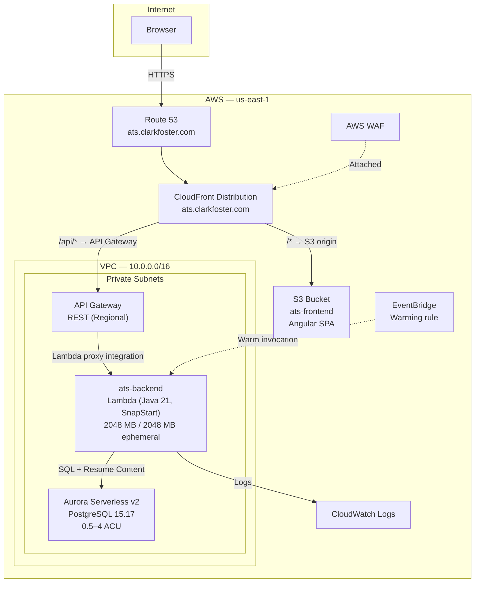

### 3.2 Component Diagram

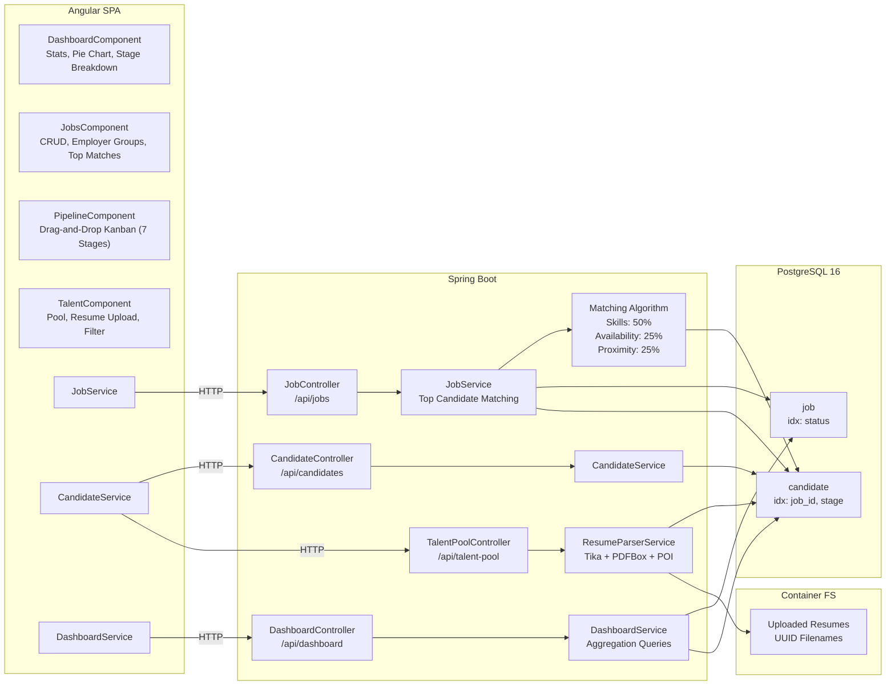

### 3.3 Data Flow Diagram

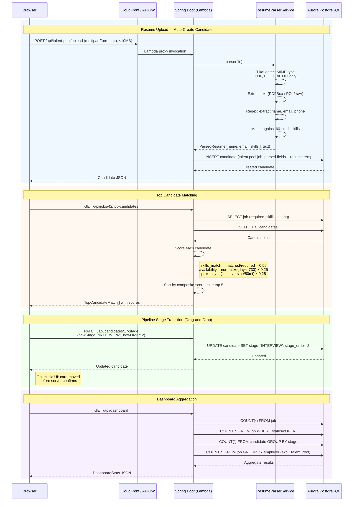

### 3.4 Component Explanations

| Component | Purpose |
|-----------|---------|
| **PipelineComponent** | Drag-and-drop Kanban board using Angular CDK `DragDropModule`. Displays candidates across 7 columns (APPLIED through HIRED/REJECTED). Performs optimistic UI updates — the card moves immediately and rolls back if the API call fails. |
| **ResumeParserService** | Accepts PDF, DOCX, and TXT uploads. Uses Apache Tika for MIME type detection (rejects other file types). Extracts text via PDFBox (PDF) or Apache POI (DOCX). Applies regex patterns to extract name, email, and phone. Matches extracted text against a curated list of 60+ technical skills. Creates a candidate record in the talent pool with all parsed fields. |
| **Matching Algorithm** | Composite scoring system for ranking candidates against a job. Three weighted factors: skill overlap (50%), availability based on recency of last assignment (25%), and geographic proximity via Haversine formula (25%). Proximity caps at 50 miles — candidates beyond that distance score zero on that factor. Returns top 5 matches. |
| **Aurora Serverless v2** | Managed PostgreSQL 15.17 database (0.5–4 ACU). Stores jobs, candidates, pipeline stages, and parsed resume text. Seeded on first boot with 6 jobs and 100 candidates for immediate demonstration. Indexed on `job_id`, `stage`, and `status` for query performance. Automated backups and point-in-time recovery. |
| **Lambda Ephemeral Storage (Resume Parsing)** | Uploaded resumes are temporarily written to Lambda's `/tmp` ephemeral storage (2048 MB) with UUID-based filenames to prevent path traversal. Parsed and stored in Aurora as text content. Files are processed synchronously and cleaned up after parsing. The 10 MB API Gateway payload limit constrains per-invocation memory impact. |
| **TalentComponent** | Central talent pool UI with debounced search (300ms), multi-select skill filter tags, and pagination (12 per page). Supports resume upload via a modal dialog. Displays candidate cards with skills, contact info, and notes. |

### 3.5 Architecture Rationale

**Why this architecture:**

An ATS is inherently relational — jobs have candidates, candidates have stages, and matching requires joins across both tables. PostgreSQL handles this well and provides geographic functions that support the proximity calculation. Aurora Serverless v2 provides a production-grade managed PostgreSQL instance that scales toward zero during idle periods. The resume parser runs in-process (Tika, PDFBox, POI) within the Lambda function rather than calling an external NLP service, keeping the system self-contained. Resume content is stored in Aurora rather than ephemeral container filesystems.

**Key tradeoffs:**

| Decision | Benefit | Cost |
|----------|---------|------|
| Aurora Serverless v2 vs. always-on RDS | Scales near-zero during idle, managed backups, point-in-time recovery | First query after Aurora idle period has 1–2 second reconnection delay |
| In-process resume parsing (Tika/PDFBox/POI) vs. external service | No external dependencies, no API costs, deterministic behavior | Limited extraction quality — regex-based name/email parsing is brittle for non-standard resume formats. No OCR for scanned PDFs. |
| Resume content stored in Aurora vs. S3 | Simple implementation, content immediately queryable from DB | Less efficient for large binary files; at scale, S3 with pre-signed URLs would be preferred |
| Haversine distance for proximity vs. geocoding API | No external API calls, no rate limits, deterministic | Requires lat/lng to be pre-populated on both jobs and candidates. Straight-line distance, not driving distance. |
| No authentication (demo mode) vs. full auth | Faster to demonstrate, no login friction | Not production-safe. Any user can modify any data. Acceptable for a portfolio demonstration. |
| Optimistic UI for drag-and-drop vs. wait for server | Immediate visual feedback, snappier UX | Must handle rollback on failure; risk of brief inconsistent state if API errors |

---

## 4. Shared Cloud Infrastructure

### 4.1 High-Level Architecture

```mermaid
graph TB
    subgraph Internet
        Users["Users"]
    end

    subgraph GitHub["GitHub"]
        Repo["Repository<br/>clark22134/MyPortfolioWebsite"]
        GHA["GitHub Actions<br/>OIDC Federation"]
    end

    subgraph AWS["AWS — us-east-1"]
        subgraph Edge["Edge Layer (Global)"]
            Route53["Route 53<br/>clarkfoster.com / *.clarkfoster.com"]
            WAF["AWS WAF (CloudFront-attached)<br/>Rate Limiting, OWASP, SQLi, Geo-Block"]
            ACM["ACM<br/>Multi-SAN Certificate"]
            CF_P["CloudFront — clarkfoster.com"]
            CF_E["CloudFront — shop.clarkfoster.com"]
            CF_A["CloudFront — ats.clarkfoster.com"]
        end

        subgraph Static["S3 Static Hosting"]
            S3_P["S3 — portfolio-frontend"]
            S3_E["S3 — ecommerce-frontend"]
            S3_A["S3 — ats-frontend"]
        end

        subgraph Network["VPC — 10.0.0.0/16"]
            subgraph Private["Private Subnets"]
                APIGW_P["API Gateway — Portfolio"]
                APIGW_E["API Gateway — E-Commerce"]
                APIGW_A["API Gateway — ATS"]
                L_P["Lambda — portfolio-backend"]
                L_E["Lambda — ecommerce-backend"]
                L_A["Lambda — ats-backend"]
                subgraph Aurora["Aurora Serverless v2 — Shared Cluster"]
                    DB_P["portfolio-db<br/>PostgreSQL 15.17"]
                    DB_E["ecommerce-db<br/>PostgreSQL 15.17"]
                    DB_A["ats-db<br/>PostgreSQL 15.17"]
                end
            end
        end

        subgraph Services["AWS Services"]
            SM["Secrets Manager<br/>DB Credentials (Aurora-managed)"]
            CW["CloudWatch<br/>6 Log Groups"]
            IAM["IAM<br/>OIDC Provider<br/>Lambda Execution Roles<br/>GH Actions Role"]
            EB["EventBridge<br/>3 Warming Rules"]
        end

        subgraph State["Terraform State — eu-west-2"]
            TF_S3["S3 Bucket<br/>clarkfoster-portfolio-tf-state"]
            DDB["DynamoDB<br/>portfolio-terraform-locks"]
        end
    end

    Users -->|HTTPS| Route53
    Route53 --> CF_P & CF_E & CF_A
    WAF -.->|Attached| CF_P & CF_E & CF_A
    ACM -.->|TLS| CF_P & CF_E & CF_A
    CF_P -->|S3 origin| S3_P
    CF_E -->|S3 origin| S3_E
    CF_A -->|S3 origin| S3_A
    CF_P -->|/api/*| APIGW_P
    CF_E -->|/api/*| APIGW_E
    CF_A -->|/api/*| APIGW_A
    APIGW_P --> L_P --> DB_P
    APIGW_E --> L_E --> DB_E
    APIGW_A --> L_A --> DB_A

    GHA -->|OIDC AssumeRole| IAM
    GHA -->|mvn package → upload JAR| L_P & L_E & L_A
    GHA -->|npm build → S3 sync| S3_P & S3_E & S3_A
    GHA -->|Read/Write State| TF_S3
    GHA -->|Lock State| DDB

    SM -.->|Inject Secrets| L_P & L_E & L_A
    L_P & L_E & L_A -->|Logs| CW
    EB -.->|Warm invocations| L_P & L_E & L_A
```

### 4.2 Component Diagram — Networking & Security

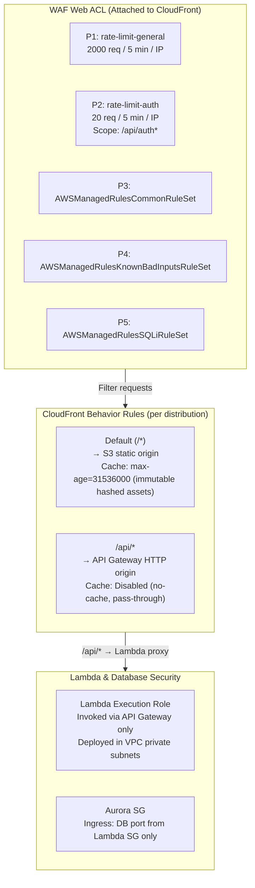

### 4.3 Data Flow Diagram — CI/CD Deployment Pipeline

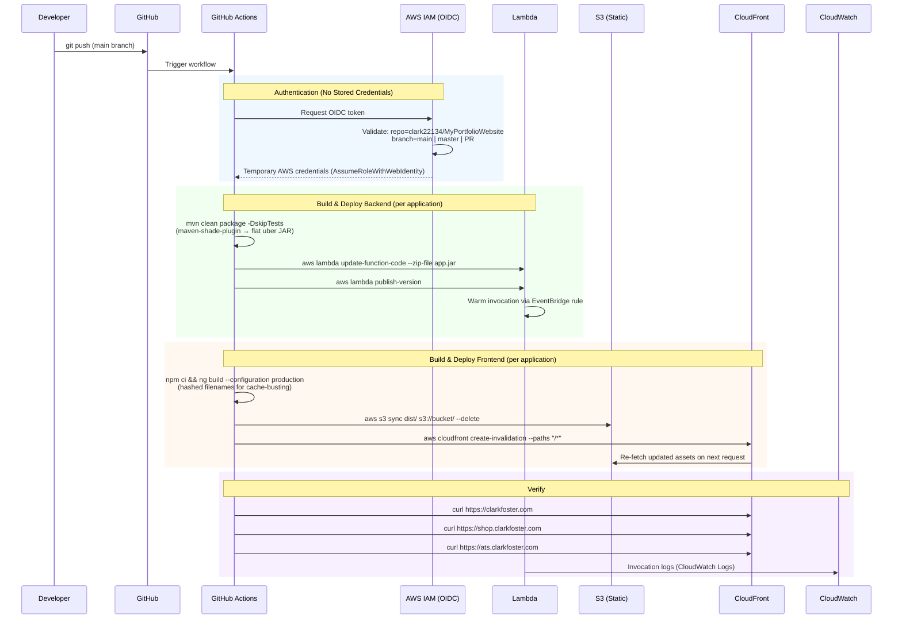

### 4.4 Data Flow Diagram — Request Path (End-to-End)

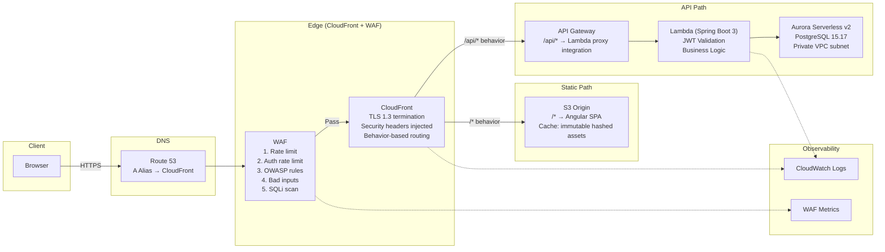

### 4.5 Component Explanations

| Component | Purpose |
|-----------|---------|
| **Route 53** | DNS resolution for all four hostnames (apex, www, shop, ats). Alias A records point to CloudFront distributions — no intermediate CNAME hop. |
| **AWS WAF** | First line of defense attached to each CloudFront distribution. Five rules in priority order: general rate limiting, auth-specific rate limiting, and three AWS managed rule sets (OWASP common, known bad inputs, SQLi). All rules emit CloudWatch metrics. |
| **ACM Certificate** | Single certificate with four SANs (clarkfoster.com, www, shop, ats). DNS-validated via Route 53 records. Must be issued in us-east-1 for CloudFront. Uses create-before-destroy lifecycle to avoid downtime during renewal. |
| **CloudFront (3 distributions)** | CDN and TLS termination layer. Each distribution has two behaviors: `/*` → S3 static hosting, `/api/*` → API Gateway origin. Security headers (CSP, HSTS, X-Frame-Options) are injected via CloudFront response headers policy. |
| **API Gateway (3 HTTP APIs)** | Serverless HTTP API acting as the Lambda proxy integration. Routes all `/api/*` requests to the corresponding Lambda function. Provides throttling and request validation. |
| **Lambda (3 functions)** | Spring Boot 3.5.13 on Java 21 packaged as flat uber JARs via maven-shade-plugin. Uses `aws-serverless-java-container-springboot3` adapter (`StreamLambdaHandler`). SnapStart reduces cold start times. EventBridge warming rules invoke each function every 4 minutes. |
| **S3 (3 static hosting buckets)** | Hosts the compiled Angular SPA for each application. Versioned hashed filenames enable aggressive cache-control headers. Bucket policy restricts access to CloudFront origin access control only — no public direct access. |
| **Aurora Serverless v2 (1 shared cluster, 3 databases)** | PostgreSQL 15.17, 0.5–4 ACU. Single shared cluster hosts three databases (portfolio, ecommerce, ats). Scales to near-zero when idle. Cluster is in private VPC subnets; Lambda functions connect via security group rules. |
| **Secrets Manager** | Stores Aurora-managed database credentials only. JWT signing key, admin password, and SMTP credentials are now Terraform variables injected as Lambda environment variables. No long-lived application secrets stored in Secrets Manager. |
| **EventBridge (3 rules)** | Scheduled rules invoke each Lambda function every 4 minutes to keep the JVM warm and prevent cold starts. |
| **CloudWatch** | Centralized logging for Lambda invocations and API Gateway access logs. 7-day retention balances troubleshooting access with storage cost. |
| **GitHub Actions (OIDC)** | CI/CD pipeline with keyless AWS authentication. The OIDC provider trusts the GitHub repository and branch. No long-lived AWS access keys stored in GitHub. The IAM role grants permissions for Lambda updates, S3 sync, CloudFront invalidation, and Terraform state access. |
| **Terraform Remote State** | S3 bucket in eu-west-2 with versioning and AES256 encryption. DynamoDB table provides state locking to prevent concurrent Terraform runs. Bootstrap module creates these resources before the main configuration is applied. |

### 4.6 Architecture Rationale

**Why this architecture:**

Three independent Lambda functions replace a shared ECS cluster — isolating blast radius per application and eliminating always-on compute costs. CloudFront serves as the single entry point for each domain: static assets from S3 with aggressive caching, API traffic proxied to Lambda. Aurora Serverless v2 replaces sidecar database containers, providing managed backups, high availability, and near-zero idle costs. Terraform codifies the entire stack, and GitHub Actions OIDC removes the need for stored AWS credentials.

**Key tradeoffs:**

| Decision | Benefit | Cost |
|----------|---------|------|
| Lambda per application vs. shared ECS cluster | Isolated blast radius — one Lambda's cold start or failure does not affect others. No always-on compute costs (~$63/month total vs. ~$200/month ECS Fargate). | Cold starts on first request after idle. Mitigated by EventBridge 4-minute warming rules. |
| Aurora Serverless v2 vs. sidecar database containers | Managed backups, automated patching, point-in-time recovery, multi-AZ failover. Near-zero idle cost (0.5 ACU minimum). | Cannot trivially inspect database without VPC bastion or tunneling. Initial connection cold start ~2–3s after long idle. |
| CloudFront + S3 vs. Nginx on ECS | Zero server management for static content. Global CDN edge caching. Security headers via response headers policy. S3 costs far less than always-on Nginx containers. | Cache invalidation required on every frontend deploy. |
| Lambda via API Gateway vs. ALB + ECS | No load balancer cost (~$16/month each, ~$48/month for 3). Lambda scales to zero when idle. | Lambda concurrency limits and 15-minute max duration apply. Streaming responses require response streaming configuration. |
| GitHub Actions OIDC vs. stored IAM access keys | No long-lived credentials to rotate or leak. Token scoped to specific repo and branch. | Slightly more complex IAM trust policy. Debugging OIDC failures is less intuitive than key-based auth. |
| 7-day CloudWatch log retention vs. longer | Low storage cost. | Limited historical debugging. Acceptable for a portfolio site — production systems would use 30–90 days or archive to S3. |
| Terraform remote state in eu-west-2 vs. us-east-1 | Separates state from application infrastructure. Reduces risk of accidental deletion when working in us-east-1. | Cross-region latency on `terraform plan/apply` (minimal in practice). |
