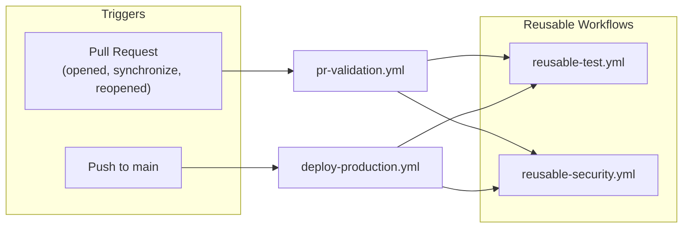
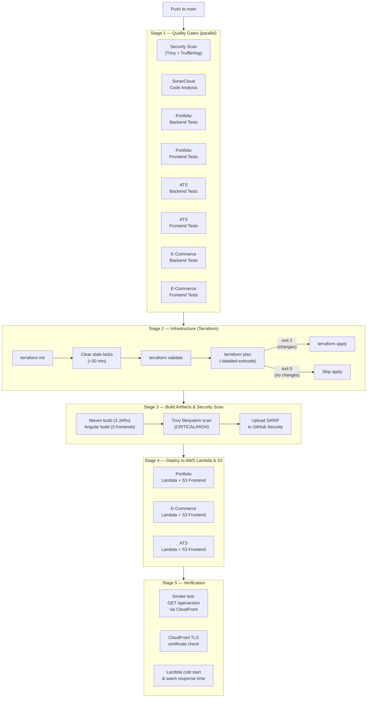
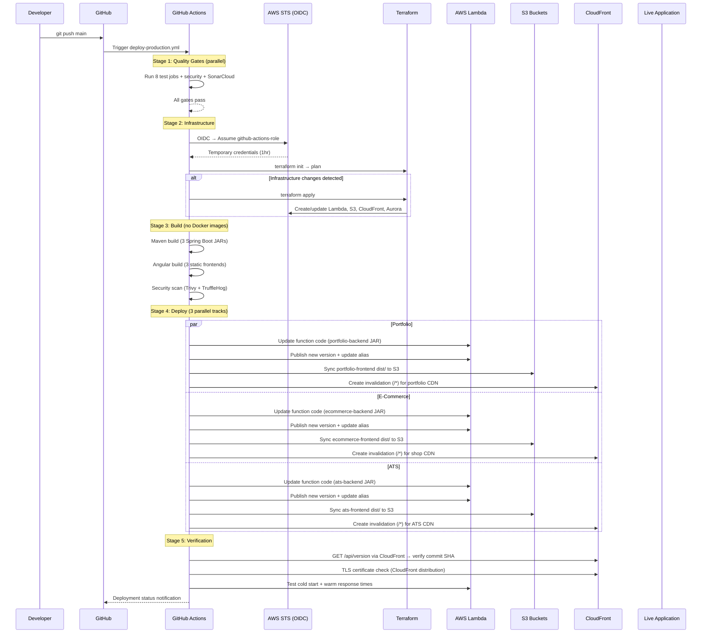
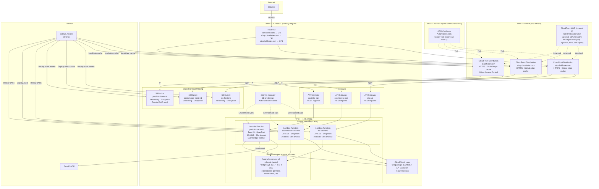
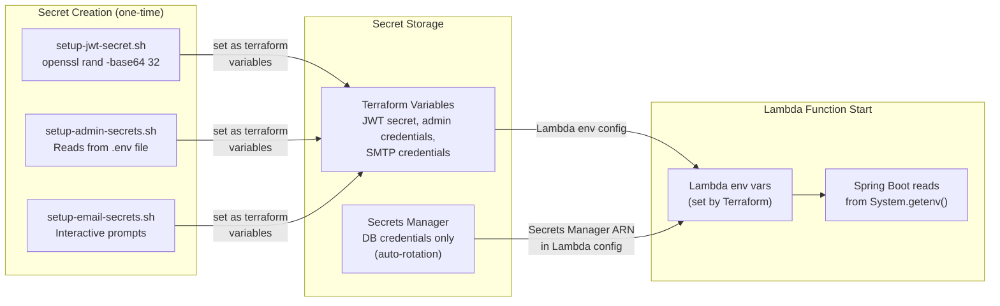
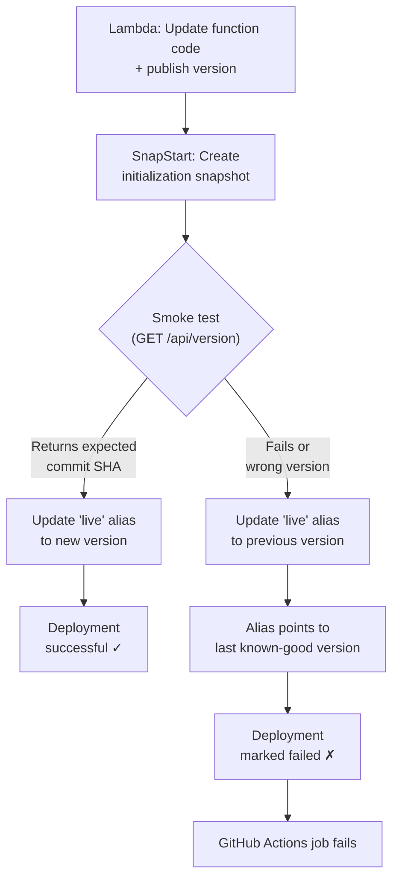

# DevOps & Infrastructure

**Author:** Clark Foster
**Last Updated:** April 2026

---

## Table of Contents

1. [CI/CD Pipeline](#1-cicd-pipeline)
2. [Build Process](#2-build-process)
3. [Deployment Process](#3-deployment-process)
4. [Infrastructure](#4-infrastructure)
5. [Environment Management](#5-environment-management)
6. [Secrets Handling](#6-secrets-handling)
7. [Rollbacks & Failure Handling](#7-rollbacks--failure-handling)
8. [Dependency Management](#8-dependency-management)
9. [Observability](#9-observability)

---

## 1. CI/CD Pipeline

The project uses GitHub Actions with two primary workflows and three reusable workflows. Pull requests run quality gates without deploying. Merges to `main` run the same gates and then deploy to production.

### 1.1 Workflow Architecture



### 1.2 Pull Request Validation (`pr-validation.yml`)

Every pull request runs 10 parallel jobs before a merge is possible:

| Job | What It Does |
|-----|-------------|
| **PR Quality Checks** | Auto-labels PR based on changed paths (backend, frontend, infrastructure, docs, deps, security, tests) using `.github/labeler.yml` |
| **Security Scan** | Trivy filesystem scan (CRITICAL/HIGH) + TruffleHog secret scanning (verified secrets only) |
| **Backend Tests** (×3) | `mvn clean test` + `mvn package` + JaCoCo coverage for portfolio, e-commerce, and ATS backends |
| **Frontend Tests** (×3) | `npm ci` → lint → `ng test` → production build for portfolio, e-commerce, and ATS frontends |
| **Accessibility Test** | Serves portfolio frontend build, runs axe-core WCAG 2.1 AA audit via Puppeteer (depends on frontend test artifact) |
| **Dependency Audit** | `npm audit` (moderate+) on all 3 frontends + `mvn dependency-check:check` (CVSS ≥ 7) on all 3 backends |
| **Automated Code Review** | CodeRabbit AI reviewer posts comments on non-trivial changes |

**Concurrency:** `pr-${{ pull_request.number }}` — new pushes to the same PR cancel in-progress runs. Each PR gets one active validation at a time.

### 1.3 Production Deployment (`deploy-production.yml`)

Triggered on every push to `main`. Deploys to production through a 5-stage pipeline:



**Concurrency:** `deploy-production` with `cancel-in-progress: false` — deployments are serialized. If two pushes to `main` happen in quick succession, the second queues behind the first. Deployments are never cancelled mid-flight.

### 1.4 Reusable Workflows

The pipeline avoids duplication through two reusable workflows that both PR validation and production deployment call:

**`reusable-test.yml`** — Parameterized test runner for any component:

| Input | Example | Effect |
|-------|---------|--------|
| `component` | `ats-backend` | Sets working directory |
| `type` | `java` or `node` | Selects JDK/Node setup, test command, artifact type |
| `node-test-args` | `--no-watch --code-coverage --browsers=ChromeHeadless` | Passed to `ng test` (Node only) |

- Java path: `setup-java@v4` (JDK 21, Temurin) → `mvn clean test` → `mvn package -DskipTests` → `jacoco:report` → upload JAR artifact (1-day retention) → Codecov upload
- Node path: `setup-node@v5` (Node 22) → `npm ci` → lint → `ng test` → production build → upload `dist/` artifact (1-day retention) → Codecov upload

**`reusable-security.yml`** — Security scanning:
- Trivy filesystem scan of the entire repo (CRITICAL/HIGH severity) → SARIF upload to GitHub Security tab
- TruffleHog secret scanning (verified secrets only) comparing base commit to head commit

### 1.5 SonarCloud Integration

Configured via [sonar-project.properties](../sonar-project.properties):

```
sonar.sources = portfolio-backend/src/main/java,
                portfolio-frontend/src/app,
                ats-backend/src/main/java,
                ats-frontend/src/app,
                ecommerce-backend/src/main/java,
                ecommerce-frontend/src/app

sonar.tests  = portfolio-backend/src/test/java,
               ats-backend/src/test/java,
               ecommerce-backend/src/test/java
```

All 6 codebases are analyzed in a single SonarCloud project. Coverage comes from JaCoCo (Java backends) and lcov (frontend). Test files (`*.spec.ts`) are excluded from main source analysis.

---

## 2. Build Process

### 2.1 Serverless Deployment Strategy

The serverless architecture eliminates Docker images in favor of direct Lambda deployment packages and S3-hosted static frontends:

**Backend Lambda packages (portfolio, e-commerce, ATS):**

```
┌─────────────────────────────────────────────┐
│ Step 1: Maven Build (Spring Boot fat JAR)   │
│   mvn clean package -DskipTests             │
│   Output: target/*-SNAPSHOT.jar (~40MB)     │
├─────────────────────────────────────────────┤
│ Step 2: Lambda Deployment                   │
│   Upload JAR to Lambda function             │
│   Runtime: Java 21 with SnapStart enabled  │
│   Configuration: 2048MB memory, 512MB /tmp  │
│   Warm-up: EventBridge rule (4min interval) │
│   Environment: DB secrets from Secrets Mgr  │
└─────────────────────────────────────────────┘
```

**Frontend Static Hosting (portfolio, e-commerce, ATS):**

```
┌─────────────────────────────────────────────┐
│ Step 1: Angular Production Build            │
│   npm ci → npm run build --configuration=   │
│            production                       │
│   Output: dist/ (~5MB static assets)        │
├─────────────────────────────────────────────┤
│ Step 2: S3 Upload                           │
│   aws s3 sync dist/ s3://bucket/ --delete   │
│   Bucket config: Versioning + encryption    │
│   Access: CloudFront Origin Access Control  │
├─────────────────────────────────────────────┤
│ Step 3: CloudFront Invalidation             │
│   aws cloudfront create-invalidation        │
│   Paths: /* (clear all cached content)      │
│   Ensures users get latest version          │
└─────────────────────────────────────────────┘
```

**Database Migration (Aurora Serverless v2):**

```
┌─────────────────────────────────────────────┐
│ PostgreSQL 15.17 (all 3 databases)           │
│   - Auto-scaling: 0.5–4 ACU                 │
│   - Backup retention: 7 days                │
│   - Encryption at rest: AES-256             │
│   - Connection: Via VPC from Lambda         │
│   - Credentials: Secrets Manager rotation   │
└─────────────────────────────────────────────┘
```

### 2.2 Lambda Configuration

| Configuration | Value | Rationale |
|--------------|-------|-----------|
| **Runtime** | Java 21 (Corretto) | Spring Boot 3+ requirement |
| **SnapStart** | Enabled | Reduces cold starts from ~8s to 1-2s |
| **Memory** | 2048 MB | Optimal for Spring Boot workloads |
| **Timeout** | 30 seconds | API Gateway maximum |
| **/tmp storage** | 2048 MB | Resume parsing, temp file operations |
| **Architecture** | x86_64 | Widest library compatibility |
| **VPC** | Private subnets | Secure Aurora connectivity |
| **Warm-up** | EventBridge (4min) | Maintain warm snapshots |

### 2.3 Versioning & Tagging

| Context | Tag Format | Example |
|---------|-----------|---------|
| GitHub Actions (production) | Git commit SHA in Lambda environment variable | `GIT_COMMIT=a1b2c3d4e5f6...` |
| S3 Objects | Versioning enabled (automatic) | S3 manages version IDs |
| Lambda Versions | $LATEST (continuous
```

### 2.4 Makefile

The [Makefile](../Makefile) provides local development shortcuts across all 6 codebases:

| Command | Scope | Action |
|---------|-------|--------|
| `make install` | All 6 projects | `mvn clean install -DskipTests` (×3) + `npm install` (×3) |
| `make build` | All 6 projects | `mvn clean package -DskipTests` (×3) + `npm run build` (×3) |
| `make test` | All 6 projects | `mvn test` (×3) + `npm test` (×3) |
| `make clean` | All 6 projects | `mvn clean` (×3) + `rm -rf dist node_modules` (×3) |
| `make docker-build` | Docker Compose (local dev) | `docker build` for local testing only |
| `make docker-up` | Compose stack (local dev) | `docker compose up -d` for local development |
| `make docker-down` | Compose stack | `docker compose down` |
| `make terraform-plan` | Infrastructure | `cd terraform && terraform plan` |
| `make terraform-apply` | Infrastructure | `cd terraform && terraform apply -auto-approve` |

**Note:** Docker commands are for local development only. Production uses serverless deployment (Lambda + S3 + CloudFront).

---

## 3. Deployment Process

### 3.1 Serverless Deployment Flow Diagram



### 3.2 Lambda Deployment Mechanics

Each Lambda function deployment follows this sequence:

1. **Build JAR** — Maven creates a Spring Boot fat JAR with all dependencies included (~40MB). The `GIT_COMMIT` environment variable is set at deployment time.

2. **Update function code** — The AWS CLI uploads the JAR to the Lambda function:
   ```bash
   aws lambda update-function-code \
     --function-name portfolio-backend \
     --zip-file fileb://target/portfolio-backend-SNAPSHOT.jar
   ```

3. **Publish version** — Creates an immutable numbered version (e.g., v42) of the deployed code.

4. **Update alias** — Points the `live` alias to the new version, enabling instant rollback by reassigning the alias to a previous version.

5. **SnapStart optimization** — Terraform configures Lambda SnapStart, which creates a snapshot of the initialized execution environment (Spring Boot context loaded). This reduces cold starts from ~8s to 1-2s.

### 3.3 Frontend Deployment Mechanics

Each frontend deployment involves S3 upload and CloudFront cache invalidation:

1. **Build dist/** — Angular production build generates optimized static assets (HTML, JS, CSS) with content hashing.

2. **S3 sync** — Uploads new/changed files to the S3 bucket, deletes removed files:
   ```bash
   aws s3 sync dist/ s3://portfolio-frontend-bucket/ \
     --delete \
     --cache-control "public,max-age=31536000,immutable" \
     --exclude="index.html" \
     --exclude="*.map"
   
   aws s3 cp dist/index.html s3://portfolio-frontend-bucket/index.html \
     --cache-control "public,max-age=0,must-revalidate"
   ```

3. **CloudFront invalidation** — Clears the CDN edge cache so users get the latest version immediately:
   ```bash
   aws cloudfront create-invalidation \
     --distribution-id E1234567890ABC \
     --paths "/*"
   ```

### 3.4 Parallel Deployment Strategy

The three application deployments (`deploy-portfolio`, `deploy-ecommerce`, `deploy-ats`) run in parallel, each on its own GitHub Actions runner. They share no state — each authenticates to AWS independently via OIDC.

This reduces total deployment time from ~15 minutes (ECS Fargate) to ~3-5 minutes (serverless), with most time spent on CloudFront invalidation propagation.

### 3.5 Manual Deployment

The [scripts/deploy-serverless.sh](../scripts/deploy-serverless.sh) script provides a local deployment path when GitHub Actions is unavailable:

```
deploy-serverless.sh
├── Check prerequisites (terraform, AWS CLI, maven, npm)
├── Confirm backup exists (main.tf.fargate-backup)
├── Run terraform init + validate
├── Show terraform plan for review
├── Prompt for confirmation
├── Apply Terraform changes (infrastructure)
├── For each backend:
│   ├── cd {backend-dir} && mvn clean package -DskipTests
│   ├── aws lambda update-function-code --zip-file fileb://target/*.jar
│   ├── aws lambda publish-version
│   └── aws lambda update-alias --name live --function-version $VERSION
├── For each frontend:
│   ├── cd {frontend-dir} && npm ci && npm run build
│   ├── aws s3 sync dist/ s3://{bucket}/ --delete
│   └── aws cloudfront create-invalidation --paths "/*"
├── Wait for CloudFront invalidations to complete
└── Verify endpoints: GET /api/version via CloudFront
```

The script mirrors the GitHub Actions workflow but uses timestamp-based tags instead of SHA tags and authenticates via local AWS CLI credentials instead of OIDC.

### 3.5 Post-Deployment Verification

After all three application groups stabilize, the `post-deploy` job runs three checks:

| Check | Method | Pass Criteria |
|-------|--------|--------------|
| **Version verification** | `curl https://clarkfoster.com/api/version` | Response `.commit` matches `${{ github.sha }}` |
| **TLS validity** | `openssl s_client` → `x509 -dates` | Certificate not expired |
| **Response time** | `time curl -s https://clarkfoster.com` | Site responds (no timeout) |

Version mismatch emits a warning rather than failing the workflow — the backend may still be restarting when the check runs.

---

## 4. Infrastructure

### 4.1 Serverless Architecture Overview



### 4.2 Terraform Modules

The serverless infrastructure is defined across 8 Terraform modules (~2190 lines, Terraform ≥ 1.0, AWS Provider ~> 6.38):

| Module | Key Resources | Lines |
|--------|--------------|-------|
| `modules/networking` | VPC, 2 public + 2 private subnets, IGW, NAT gateways, route tables | ~100 |
| `modules/acm` | SSL certificate (4 SANs), DNS validation records, **us-east-1 provider** | ~60 |
| `modules/s3-static` | S3 bucket, versioning, encryption, lifecycle policy, optional CloudFront OAC policy | ~80 |
| `modules/cloudfront` | CloudFront distribution, OAC, cache behaviors (S3 + API origins), SPA error responses | ~120 |
| `modules/cloudfront-waf` | WAF WebACL (2 rate limits, 3 AWS managed rules), **us-east-1 provider** | ~100 |
| `modules/api-gateway` | REST API, Lambda proxy integration, deployment, stage, CloudWatch logging | ~90 |
| `modules/lambda` | Lambda function, VPC config, SnapStart, IAM role, security groups, EventBridge warmer, placeholder ZIP | ~280 |
| `modules/aurora` | Aurora Serverless v2 cluster, subnet group, Secrets Manager integration, auto-scaling (0.5–4 ACU) | ~150 |
| `modules/route53` | 3 A records (aliased to CloudFront distributions) | ~40 |

**Remote state backend:** S3 bucket (`clarkfoster-portfolio-tf-state`) with DynamoDB locking (`portfolio-terraform-locks`), provisioned separately via `terraform/bootstrap/`. The bootstrap resources use `prevent_destroy = true` and `PAY_PER_REQUEST` billing.

**Multi-region deployment:** CloudFront and WAF resources must be created in `us-east-1` (AWS requirement). The `modules/acm` and `modules/cloudfront-waf` modules use the `aws.us_east_1` provider alias. All other resources are in `eu-west-2`.

### 4.3 Infrastructure as Code Structure

```
terraform/
├── main.tf                          # Root module: 3 complete application stacks
├── variables.tf                     # Input variables (domain, environment, region)
├── providers.tf                     # AWS provider (eu-west-2) + alias (us-east-1)
├── outputs.tf                       # Outputs (CloudFront URLs, Lambda ARNs, DB endpoints)
├── main.tf.fargate-backup           # Backup of original ECS/Fargate configuration
├── bootstrap/                       # S3 + DynamoDB for remote state (one-time setup)
└── modules/
    ├── networking/                  # VPC, subnets, gateways
    ├── acm/                         # SSL certificates (us-east-1)
    ├── s3-static/                   # S3 buckets for frontend hosting
    ├── cloudfront/                  # CloudFront distributions
    ├── cloudfront-waf/              # WAF WebACL (us-east-1)
    ├── api-gateway/                 # API Gateway REST APIs
    ├── lambda/                      # Lambda functions
    │   └── placeholder.zip          # Empty ZIP for initial Lambda creation
    ├── aurora/                      # Aurora Serverless v2 clusters
    └── route53/                     # DNS records
```

### 4.4 Stale Lock Handling

The Terraform step in CI includes an automatic stale lock cleaner. If a previous CI run was cancelled mid-apply, the DynamoDB lock may remain. The pipeline checks the lock's age — if it's older than 30 minutes, it's cleared automatically. This prevents deployments from being permanently blocked by an orphaned lock.

### 4.5 Conditional Apply

Terraform's `-detailed-exitcode` flag drives the apply decision:

| Exit Code | Meaning | Action |
|-----------|---------|--------|
| 0 | No changes | Skip apply entirely |
| 1 | Plan error | Fail the pipeline |
| 2 | Changes detected | Run `terraform apply` |

Most deployments exit 0 — infrastructure rarely changes between application deployments. The conditional avoids the ~60-second apply overhead on every push.

---

## 5. Environment Management

### 5.1 Environment Matrix

| Surface | Configuration Method | Profile |
|---------|---------------------|---------|
| **Local (bare metal)** | `make deploy-local` → Spring Boot defaults + `ng serve` with `proxy.conf.json` | `default` |
| **Local (Docker Compose)** | `.env` file + `docker-compose.yml` environment variables + Nginx local config overrides | `prod` |
| **Production (AWS)** | Terraform variables → Lambda environment variables + Secrets Manager (DB creds only) | `prod` |

### 5.2 Docker Compose (Local)

The [docker-compose.yml](../docker-compose.yml) orchestrates all 8 containers on a single bridge network:

```
portfolio-network (bridge)
├── portfolio-backend    :8080
├── portfolio-frontend   :4200 → 80
├── ecommerce-db         :5433 → 5432  (healthcheck: pg_isready)
├── ecommerce-backend    :8081 → 8080  (depends_on: ecommerce-db healthy)
├── ecommerce-frontend   :8082 → 80
├── ats-db               :5434 → 5432  (healthcheck: pg_isready)
├── ats-backend          :8083 → 8080  (depends_on: ats-db healthy)
└── ats-frontend         :8084 → 80
```

**Key configuration details:**

- Database credentials are read from a `.env` file with required-variable guards (`${POSTGRES_PASSWORD:?Set POSTGRES_PASSWORD in .env}`). Compose fails fast if `.env` is missing required values.
- Frontend containers mount `nginx.local.conf` as a volume override. The local config proxies `/api/*` requests to the backend container by service name (e.g., `proxy_pass http://portfolio-backend:8080`). The production config is unused in serverless — CloudFront + API Gateway handle routing.
- CORS origins are scoped to `localhost` ports. Production CORS origins are set as Lambda environment variables via Terraform.
- All containers use `restart: unless-stopped` for resilience during local development.

### 5.3 Nginx Configuration Strategy

Each frontend has three Nginx configs serving different purposes:

| File | Used In | API Routing | Security Headers |
|------|---------|-------------|-----------------|
| `nginx.local.conf` | Docker Compose (volume mount) | `proxy_pass` to backend container | Minimal |
| `nginx.prod.conf` | Docker image (local dev only) | None (CloudFront + API Gateway handle routing in production) | Full (HSTS, CSP, X-Frame-Options, etc.) |
| `00-rate-limit.conf` | Docker image (local dev only) | — | Rate limiting: 30 req/s, burst=60 |

All Nginx configurations are for local Docker Compose development only. In production, CloudFront serves static frontends from S3, and API Gateway routes API requests to Lambda — no Nginx is involved.

### 5.4 Spring Profiles

All three backends use `SPRING_PROFILES_ACTIVE=prod` in Docker (local) and Lambda (production). The `prod` profile activates:

- Real database connections (PostgreSQL via Aurora Serverless v2) instead of H2
- Production CORS origins (domain-specific)
- Actuator health endpoints for API Gateway health checks

The default profile (no `SPRING_PROFILES_ACTIVE`) uses H2 in-memory databases and permissive CORS for local `ng serve` development.

---

## 6. Secrets Handling

### 6.1 Secret Categories

| Category | Secrets | Storage | Injected As |
|----------|---------|---------|-------------|
| **Authentication** | JWT signing key | Terraform variables → Lambda env vars | Lambda env var `JWT_SECRET` |
| **Admin account** | Username, password, email, full name | Terraform variables → Lambda env vars | Lambda env vars `ADMIN_*` |
| **Email (SMTP)** | Gmail username, app password, contact email | Terraform variables → Lambda env vars | Lambda env vars `MAIL_*`, `CONTACT_EMAIL` |
| **Database** | PostgreSQL username, password (shared Aurora cluster) | AWS Secrets Manager (auto-rotation) | Lambda env vars via Secrets Manager ARN |
| **CI/CD** | AWS role ARN, SonarCloud token, OpenAI API key | GitHub Secrets | GitHub Actions env |

### 6.2 Secrets Flow



### 6.3 Secret Rotation

The [scripts/rotate-all-secrets.sh](../scripts/rotate-all-secrets.sh) script handles emergency rotation after a potential exposure:

| Secret | Rotation Method |
|--------|----------------|
| `portfolio/jwt-secret` | Auto-generated: `openssl rand -base64 64` |
| `portfolio/admin-password` | Auto-generated: `openssl rand -base64 24` (displayed once) |
| `portfolio/admin-email` | Prompted (optional — press Enter to skip) |
| `portfolio/admin-username` | Prompted (optional) |
| `portfolio/admin-fullname` | Prompted (optional) |
| `portfolio/contact-email` | Prompted (optional) |
| `portfolio/mail-username` | Prompted (optional) |
| `portfolio/mail-password` | Prompted (optional) |

After rotation, the script publishes new Lambda versions so functions pick up the new values on next invocation.

### 6.4 IAM Scoping

The Lambda execution role's Secrets Manager policy is scoped to `arn:aws:secretsmanager:*:*:secret:portfolio/*`. Functions cannot read secrets from other namespaces. Most application secrets (JWT, admin, SMTP) are passed as Terraform variables directly into Lambda environment configuration — only DB credentials use Secrets Manager. The GitHub Actions OIDC role has `secretsmanager:*` access — broader than necessary, but scoped by the OIDC trust policy to only the specific GitHub repository and allowed branches.

### 6.5 Secrets Not in Secrets Manager

JWT signing keys, admin credentials, and SMTP credentials are defined as Terraform variables and injected directly into Lambda environment configuration. These values are visible to anyone with Lambda read access (already an elevated IAM permission). Only database credentials use Secrets Manager with auto-rotation, since Aurora Serverless v2 supports native Secrets Manager integration.

---

## 7. Rollbacks & Failure Handling

### 7.1 Failure Handling Flow



### 7.2 Lambda Alias-Based Rollback

Each Lambda function uses a `live` alias that points to a specific published version. Rollback is instant — reassign the alias:

```bash
aws lambda update-alias \
  --function-name portfolio-backend \
  --name live \
  --function-version {previous_version}
```

**How it works:**

1. GitHub Actions publishes a new numbered version after uploading the JAR.
2. The post-deploy smoke test verifies the new version responds correctly.
3. If verification passes, the `live` alias is updated to point to the new version.
4. If verification fails, the `live` alias remains on (or is rolled back to) the previous version.
5. Previous versions are immutable and instantly available — rollback requires no rebuild or re-upload.

### 7.3 Health Check Configuration

| Component | Health Check | Method |
|-----------|-------------|--------|
| Backend Lambda (×3) | `/api/version` | Post-deploy smoke test via CloudFront |
| Frontend S3 (×3) | `index.html` exists | S3 sync verification |
| API Gateway (×3) | Stage deployment status | AWS CLI check |

Lambda functions with SnapStart don't use traditional health checks. Instead, SnapStart pre-initializes the Spring Boot context during version publishing. The EventBridge warmer (every 4 minutes) ensures at least one warm execution environment is available, keeping response times under 500ms for most requests.

### 7.4 Lambda Deployment Timeout

Lambda function code updates complete within seconds. The deployment step waits for the function to reach `Active` state and SnapStart optimization to complete:

```bash
aws lambda wait function-updated-v2 --function-name portfolio-backend
aws lambda publish-version --function-name portfolio-backend
```

If the function doesn't reach `Active` state within the AWS CLI wait timeout, the GitHub Actions job fails. The three deployment jobs (`deploy-portfolio`, `deploy-ecommerce`, `deploy-ats`) are independent — one application failing doesn't cancel or block the other two.

### 7.5 Terraform Rollback

Terraform does not have automatic rollback. A failed `terraform apply` leaves the infrastructure in a partially-applied state. The mitigation strategies are:

| Scenario | Recovery |
|----------|----------|
| Failed apply with state saved | Re-run `terraform apply` — Terraform resumes from the saved state and applies remaining changes |
| Apply succeeded but broke the application | Revert the Terraform change in Git, push to `main`, pipeline applies the corrected config |
| State lock stuck | Pipeline auto-clears locks older than 30 minutes; manual clear via `terraform force-unlock` |
| State corruption | S3 versioning enabled — restore a previous state version from the S3 bucket |

### 7.6 Manual Rollback Procedure

If post-deploy verification doesn't catch a bad deployment (e.g., the function responds correctly but has a logic bug):

```bash
# 1. List recent Lambda versions
aws lambda list-versions-by-function \
  --function-name prod-portfolio-backend \
  --query 'Versions[-5:].{Version:Version,Description:Description}' \
  --output table

# 2. Get current alias target
aws lambda get-alias \
  --function-name prod-portfolio-backend \
  --name live

# 3. Update alias to previous version
aws lambda update-alias \
  --function-name prod-portfolio-backend \
  --name live \
  --function-version {previous_version}

# 4. Verify rollback
curl -s https://clarkfoster.com/api/version
```

Previous Lambda versions are immutable and retained indefinitely. Manual rollback requires no rebuild — it repoints the `live` alias to an already-published version. The change takes effect immediately for new invocations.

### 7.7 Failure Matrix

| Failure Point | Detection | Recovery | Downtime |
|--------------|-----------|----------|----------|
| Tests fail (CI gate) | GitHub Actions job fails | Pipeline stops before deploy. No production impact. | None |
| Terraform plan fails | Non-zero exit code | Pipeline stops. Infrastructure unchanged. | None |
| Maven/Angular build fails | Non-zero exit code | Pipeline stops before deploy. No production impact. | None |
| Lambda code update fails | AWS CLI error | Pipeline stops. Functions run old code. | None |
| Smoke test fails after deploy | Version mismatch or HTTP error | Alias remains on previous version | None (previous version serves traffic) |
| Function deploys but has logic bug | Post-deploy smoke test or user report | Manual rollback via alias update | Partial (bug is live until rollback) |
| Terraform apply partially fails | Apply error in logs | Re-run apply or revert Git change | Depends on resource |
| Secrets Manager secret deleted | Lambda can't read DB credentials on cold start | Re-create secret, publish new Lambda version | Until secret restored |

---

## 8. Dependency Management

### 8.1 Dependabot Configuration

[`.github/dependabot.yml`](../.github/dependabot.yml) monitors 5 ecosystems on a weekly schedule (every Monday):

| Ecosystem | Directories | Grouping |
|-----------|-------------|----------|
| **npm** | `portfolio-frontend/` | Minor+patch together, majors separate |
| **Maven** | `portfolio-backend/` | Minor+patch together, majors separate |
| **GitHub Actions** | `/` | All actions grouped |
| **Terraform** | `/terraform` | All providers/modules grouped |
| **Docker** | `portfolio-backend/`, `portfolio-frontend/` | All base images grouped |

All PRs use the `chore(deps)` commit prefix. Open PR limit is 5 per ecosystem to prevent noisy PR queues. Grouped updates produce a single PR with all minor/patch bumps, reducing review overhead.

### 8.2 Automated Security Scanning

Security scans run at three stages:

| Stage | Tool | Scope | Severity Filter |
|-------|------|-------|----------------|
| **PR validation** | Trivy (filesystem) | Source code + config | CRITICAL, HIGH |
| **PR validation** | TruffleHog | Git history (base→head) | Verified secrets only |
| **PR validation** | `npm audit` / `mvn dependency-check` | Dependency CVEs | Moderate+ / CVSS ≥ 7 |
| **Post-build** | Trivy (filesystem) | Built artifacts + dependencies | CRITICAL, HIGH |

All Trivy results upload to GitHub's Security tab as SARIF files — visible as code scanning alerts on the repository's Security overview.

---

## 9. Observability

### 9.1 Logging

| Service | Log Group | Retention | Log Driver |
|---------|-----------|-----------|------------|
| Portfolio Backend | `/aws/lambda/prod-portfolio-backend` | 7 days | Lambda native |
| E-Commerce Backend | `/aws/lambda/prod-ecommerce-backend` | 7 days | Lambda native |
| ATS Backend | `/aws/lambda/prod-ats-backend` | 7 days | Lambda native |
| Portfolio API Gateway | `/aws/apigateway/prod-portfolio-api` | 7 days | API Gateway native |
| E-Commerce API Gateway | `/aws/apigateway/prod-ecommerce-api` | 7 days | API Gateway native |
| ATS API Gateway | `/aws/apigateway/prod-ats-api` | 7 days | API Gateway native |

### 9.2 Health Monitoring

- **EventBridge warmers** — Every 4 minutes per Lambda function. Keeps at least one warm execution environment available.
- **Lambda metrics** — CloudWatch tracks invocations, duration, errors, throttles, cold starts, and concurrent executions per function.
- **API Gateway metrics** — Latency, 4xx/5xx error rates, and request counts per API stage.
- **WAF metrics** — CloudWatch metrics enabled for all WAF rules with sampled request logging.

### 9.3 Lambda Version Management

Lambda versions are immutable snapshots of function code and configuration. Each deployment publishes a new numbered version. Old versions are retained for rollback capability. SnapStart optimization runs during version publishing, creating a pre-initialized snapshot that reduces cold start times from ~8s to 1-2s.
