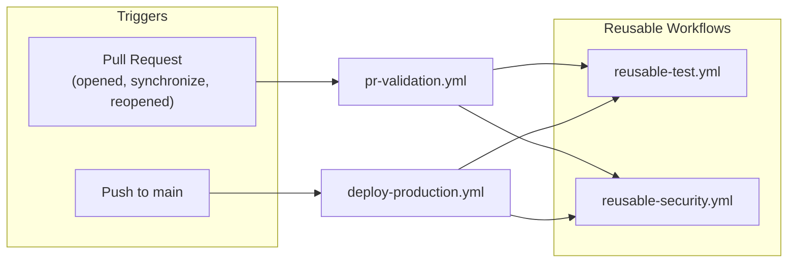
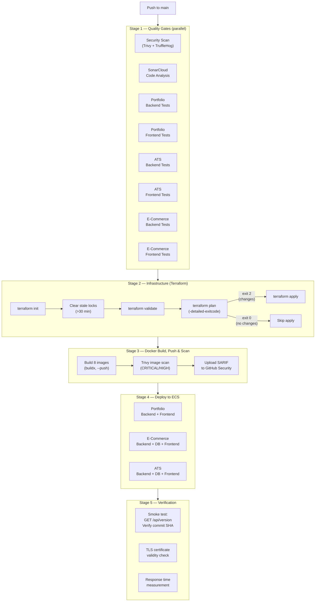
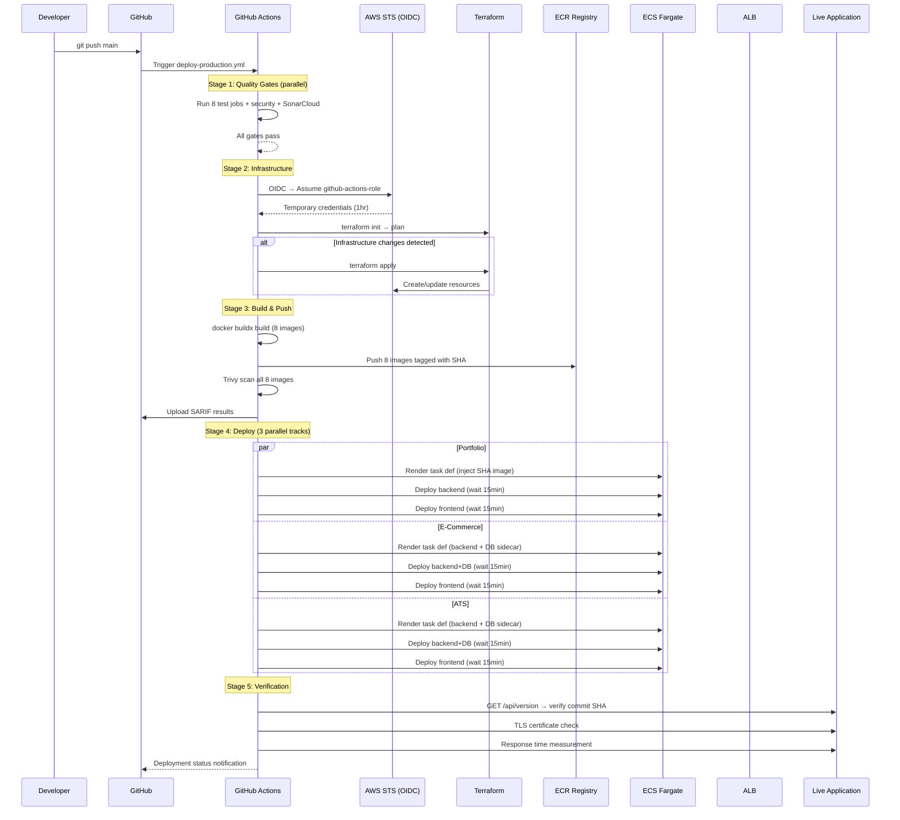
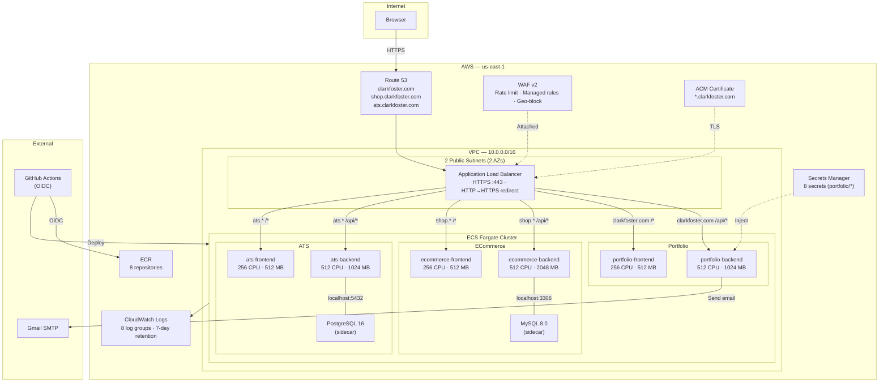
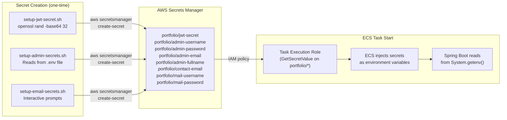
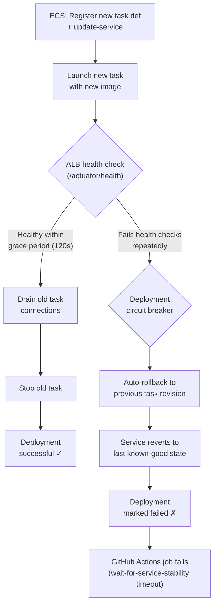

# DevOps & Infrastructure

**Author:** Clark Foster
**Last Updated:** March 2026

---

## Table of Contents

1. [CI/CD Pipeline](#1-cicd-pipeline)
2. [Build Process](#2-build-process)
3. [Deployment Process](#3-deployment-process)
4. [Infrastructure](#4-infrastructure)
5. [Environment Management](#5-environment-management)
6. [Secrets Handling](#6-secrets-handling)
7. [Rollbacks & Failure Handling](#7-rollbacks--failure-handling)
8. [Dependency Management](#8-dependency-management)
9. [Observability](#9-observability)

---

## 1. CI/CD Pipeline

The project uses GitHub Actions with two primary workflows and three reusable workflows. Pull requests run quality gates without deploying. Merges to `main` run the same gates and then deploy to production.

### 1.1 Workflow Architecture



### 1.2 Pull Request Validation (`pr-validation.yml`)

Every pull request runs 10 parallel jobs before a merge is possible:

| Job | What It Does |
|-----|-------------|
| **PR Quality Checks** | Auto-labels PR based on changed paths (backend, frontend, infrastructure, docs, deps, security, tests) using `.github/labeler.yml` |
| **Security Scan** | Trivy filesystem scan (CRITICAL/HIGH) + TruffleHog secret scanning (verified secrets only) |
| **Backend Tests** (×3) | `mvn clean test` + `mvn package` + JaCoCo coverage for portfolio, e-commerce, and ATS backends |
| **Frontend Tests** (×3) | `npm ci` → lint → `ng test` → production build for portfolio, e-commerce, and ATS frontends |
| **Accessibility Test** | Serves portfolio frontend build, runs axe-core WCAG 2.1 AA audit via Puppeteer (depends on frontend test artifact) |
| **Dependency Audit** | `npm audit` (moderate+) on all 3 frontends + `mvn dependency-check:check` (CVSS ≥ 7) on all 3 backends |
| **Automated Code Review** | CodeRabbit AI reviewer posts comments on non-trivial changes |

**Concurrency:** `pr-${{ pull_request.number }}` — new pushes to the same PR cancel in-progress runs. Each PR gets one active validation at a time.

### 1.3 Production Deployment (`deploy-production.yml`)

Triggered on every push to `main`. Deploys to production through a 5-stage pipeline:



**Concurrency:** `deploy-production` with `cancel-in-progress: false` — deployments are serialized. If two pushes to `main` happen in quick succession, the second queues behind the first. Deployments are never cancelled mid-flight.

### 1.4 Reusable Workflows

The pipeline avoids duplication through two reusable workflows that both PR validation and production deployment call:

**`reusable-test.yml`** — Parameterized test runner for any component:

| Input | Example | Effect |
|-------|---------|--------|
| `component` | `ats-backend` | Sets working directory |
| `type` | `java` or `node` | Selects JDK/Node setup, test command, artifact type |
| `node-test-args` | `--no-watch --code-coverage --browsers=ChromeHeadless` | Passed to `ng test` (Node only) |

- Java path: `setup-java@v5` (JDK 25, Temurin) → `mvn clean test` → `mvn package -DskipTests` → `jacoco:report` → upload JAR artifact (1-day retention) → Codecov upload
- Node path: `setup-node@v6` (Node 20) → `npm ci` → lint → `ng test` → production build → upload `dist/` artifact (1-day retention) → Codecov upload

**`reusable-security.yml`** — Security scanning:
- Trivy filesystem scan of the entire repo (CRITICAL/HIGH severity) → SARIF upload to GitHub Security tab
- TruffleHog secret scanning (verified secrets only) comparing base commit to head commit

### 1.5 SonarCloud Integration

Configured via [sonar-project.properties](../sonar-project.properties):

```
sonar.sources = portfolio-backend/src/main/java,
                portfolio-frontend/src/app,
                ats-backend/src/main/java,
                ats-frontend/src/app,
                ecommerce-backend/src/main/java,
                ecommerce-frontend/src/app

sonar.tests  = portfolio-backend/src/test/java,
               ats-backend/src/test/java,
               ecommerce-backend/src/test/java
```

All 6 codebases are analyzed in a single SonarCloud project. Coverage comes from JaCoCo (Java backends) and lcov (frontend). Test files (`*.spec.ts`) are excluded from main source analysis.

---

## 2. Build Process

### 2.1 Docker Image Strategy

All 8 services use multi-stage Docker builds. The pattern is identical across projects — only the base images and build commands differ:

**Backend images (portfolio, e-commerce, ATS):**

```
┌─────────────────────────────────────────────┐
│ Stage 1: maven:3-eclipse-temurin-25         │
│   COPY pom.xml → mvn dependency:go-offline  │
│   COPY src/   → mvn clean package           │
│   Output: target/*.jar (~30MB)              │
├─────────────────────────────────────────────┤
│ Stage 2: eclipse-temurin:25-jre-alpine      │
│   COPY --from=build target/*.jar app.jar    │
│   ENTRYPOINT java -jar app.jar              │
│   Final image: ~150MB                       │
└─────────────────────────────────────────────┘
```

**Frontend images (portfolio, e-commerce, ATS):**

```
┌─────────────────────────────────────────────┐
│ Stage 1: node:25-alpine                     │
│   npm ci → npm run build --configuration=   │
│            production                       │
│   Output: dist/ (~5MB static assets)        │
├─────────────────────────────────────────────┤
│ Stage 2: nginx:alpine                       │
│   COPY --from=build dist/ → /usr/share/     │
│                              nginx/html/    │
│   COPY nginx.prod.conf → /etc/nginx/...     │
│   COPY 00-rate-limit.conf → /etc/nginx/...  │
│   Final image: ~45MB                        │
└─────────────────────────────────────────────┘
```

**Database images (e-commerce-db, ats-db):**

```
┌─────────────────────────────────────────────┐
│ mysql:8.0 (e-commerce) /                    │
│ postgres:16-alpine (ATS)                    │
│   COPY init/*.sql → /docker-entrypoint-     │
│                      initdb.d/              │
│   Runs init scripts on first start          │
└─────────────────────────────────────────────┘
```

### 2.2 Image Tagging

| Context | Tag Format | Example |
|---------|-----------|---------|
| GitHub Actions (production) | Git commit SHA | `portfolio-backend:a1b2c3d4e5f6...` |
| Manual deployment script | `deploy-{unix_timestamp}` | `portfolio-backend:deploy-1711756800` |
| Local Docker Compose | `latest` (implicit) | `portfolio-backend:latest` |

SHA-based tags create an immutable link between the deployed image and the exact source code commit. The post-deploy smoke test verifies this by calling `GET /api/version` and comparing the returned commit SHA against the expected value.

### 2.3 Backend Build Arguments

Backend Dockerfiles accept a `GIT_COMMIT` build argument, embedded into the application at compile time. This powers the `/api/version` endpoint used in post-deploy verification:

```dockerfile
ARG GIT_COMMIT=unknown
ENV GIT_COMMIT=${GIT_COMMIT}
```

### 2.4 Makefile

The [Makefile](../Makefile) provides local development shortcuts across all 6 codebases:

| Command | Scope | Action |
|---------|-------|--------|
| `make install` | All 6 projects | `mvn clean install -DskipTests` (×3) + `npm install` (×3) |
| `make build` | All 6 projects | `mvn clean package -DskipTests` (×3) + `npm run build` (×3) |
| `make test` | All 6 projects | `mvn test` (×3) + `npm test` (×3) |
| `make clean` | All 6 projects | `mvn clean` (×3) + `rm -rf dist node_modules` (×3) |
| `make docker-build` | All 8 images | `docker build` for each service |
| `make docker-up` | Compose stack | `docker compose up -d` |
| `make docker-down` | Compose stack | `docker compose down` |
| `make terraform-plan` | Infrastructure | `cd terraform && terraform plan` |
| `make terraform-apply` | Infrastructure | `cd terraform && terraform apply -auto-approve` |

---

## 3. Deployment Process

### 3.1 Deployment Flow Diagram



### 3.2 ECS Deployment Mechanics

Each ECS service deployment follows this sequence:

1. **Render task definition** — The `aws-actions/amazon-ecs-render-task-definition` action takes the JSON template from `ecs-task-definitions/` and injects the new image URI (ECR registry + SHA tag) into the correct container definition.

2. **Multi-container rendering** — E-commerce and ATS backends require two render passes: one for the application container, a second pass on the output of the first to inject the database sidecar image.

3. **Register + deploy** — The `aws-actions/amazon-ecs-deploy-task-definition` action registers the new task definition revision with ECS, updates the service to use it, and waits for service stability (up to 15 minutes).

4. **Rolling update** — ECS launches a new task with the new image, waits for it to pass ALB health checks, then drains and stops the old task. At no point are zero tasks running (assuming `desired_count ≥ 1`).

### 3.3 Parallel Deployment Strategy

The three application deployments (`deploy-portfolio`, `deploy-ecommerce`, `deploy-ats`) run in parallel, each on its own GitHub Actions runner. They share no state — each authenticates to AWS independently via OIDC and operates on separate ECS services.

This reduces total deployment time from ~45 minutes (serial) to ~15 minutes (parallel, bounded by the slowest service's stabilization).

### 3.4 Manual Deployment

The [scripts/deploy-to-aws.sh](../scripts/deploy-to-aws.sh) script provides an escape hatch for deploying from a local machine when GitHub Actions is unavailable:

```
deploy-to-aws.sh
├── Check AWS credentials (sts get-caller-identity)
├── Create ECR repositories if missing
├── Login to ECR
├── Build and push all 8 images (deploy-{timestamp} tag)
├── Verify ECS cluster is active
├── For each service:
│   ├── Fetch current task definition
│   ├── Replace image URI with new tag
│   ├── Register new task definition revision
│   └── Update ECS service with --force-new-deployment
├── Wait for service stability (15-min timeout)
└── Verify all services are running
```

The script mirrors the GitHub Actions workflow but uses timestamp-based tags instead of SHA tags and authenticates via local AWS CLI credentials instead of OIDC.

### 3.5 Post-Deployment Verification

After all three application groups stabilize, the `post-deploy` job runs three checks:

| Check | Method | Pass Criteria |
|-------|--------|--------------|
| **Version verification** | `curl https://clarkfoster.com/api/version` | Response `.commit` matches `${{ github.sha }}` |
| **TLS validity** | `openssl s_client` → `x509 -dates` | Certificate not expired |
| **Response time** | `time curl -s https://clarkfoster.com` | Site responds (no timeout) |

Version mismatch emits a warning rather than failing the workflow — the backend may still be restarting when the check runs.

---

## 4. Infrastructure

### 4.1 Architecture Overview



### 4.2 Terraform Modules

The infrastructure is defined across 6 Terraform modules (Terraform ≥ 1.0, AWS Provider ~> 6.31):

| Module | Key Resources | Lines |
|--------|--------------|-------|
| `modules/networking` | VPC, 2 public subnets, IGW, route tables, DNS settings | ~60 |
| `modules/acm` | SSL certificate (4 SANs), DNS validation records | ~40 |
| `modules/alb` | ALB, 6 target groups, HTTPS listener, 6 routing rules, HTTP→HTTPS redirect | ~200 |
| `modules/ecs` | Fargate cluster, 6 services, 6 task definitions, 8 ECR repos, IAM roles, security groups, CloudWatch log groups | ~400 |
| `modules/route53` | 4 A records (aliased to ALB) | ~30 |
| `modules/waf` | Web ACL, 6 rules (2 rate limits, 3 managed rule sets, geo-block) | ~100 |

**Remote state backend:** S3 bucket (`clarkfoster-portfolio-tf-state`) with DynamoDB locking (`portfolio-terraform-locks`), provisioned separately via `terraform/bootstrap/`. The bootstrap resources use `prevent_destroy = true` and `PAY_PER_REQUEST` billing.

### 4.3 Stale Lock Handling

The Terraform step in CI includes an automatic stale lock cleaner. If a previous CI run was cancelled mid-apply, the DynamoDB lock may remain. The pipeline checks the lock's age — if it's older than 30 minutes, it's cleared automatically. This prevents deployments from being permanently blocked by an orphaned lock.

### 4.4 Conditional Apply

Terraform's `-detailed-exitcode` flag drives the apply decision:

| Exit Code | Meaning | Action |
|-----------|---------|--------|
| 0 | No changes | Skip apply entirely |
| 1 | Plan error | Fail the pipeline |
| 2 | Changes detected | Run `terraform apply` |

Most deployments exit 0 — infrastructure rarely changes between application deployments. The conditional avoids the ~60-second apply overhead on every push.

---

## 5. Environment Management

### 5.1 Environment Matrix

| Surface | Configuration Method | Profile |
|---------|---------------------|---------|
| **Local (bare metal)** | `make deploy-local` → Spring Boot defaults + `ng serve` with `proxy.conf.json` | `default` |
| **Local (Docker Compose)** | `.env` file + `docker-compose.yml` environment variables + Nginx local config overrides | `prod` |
| **Production (AWS)** | ECS task definition environment + Secrets Manager injection | `prod` |

### 5.2 Docker Compose (Local)

The [docker-compose.yml](../docker-compose.yml) orchestrates all 8 containers on a single bridge network:

```
portfolio-network (bridge)
├── portfolio-backend    :8080
├── portfolio-frontend   :4200 → 80
├── ecommerce-db         :3307 → 3306  (healthcheck: mysqladmin ping)
├── ecommerce-backend    :8081 → 8080  (depends_on: ecommerce-db healthy)
├── ecommerce-frontend   :8082 → 80
├── ats-db               :5434 → 5432  (healthcheck: pg_isready)
├── ats-backend          :8083 → 8080  (depends_on: ats-db healthy)
└── ats-frontend         :8084 → 80
```

**Key configuration details:**

- Database credentials are read from a `.env` file with required-variable guards (`${MYSQL_PASSWORD:?Set MYSQL_PASSWORD in .env}`). Compose fails fast if `.env` is missing required values.
- Frontend containers mount `nginx.local.conf` as a volume override. The local config proxies `/api/*` requests to the backend container by service name (e.g., `proxy_pass http://portfolio-backend:8080`). The production config omits this because the ALB handles routing.
- CORS origins are scoped to `localhost` ports. Production CORS origins are set in the ECS task definition.
- All containers use `restart: unless-stopped` for resilience during local development.

### 5.3 Nginx Configuration Strategy

Each frontend has three Nginx configs serving different purposes:

| File | Used In | API Routing | Security Headers |
|------|---------|-------------|-----------------|
| `nginx.local.conf` | Docker Compose (volume mount) | `proxy_pass` to backend container | Minimal |
| `nginx.prod.conf` | Docker image (baked in) | None (ALB handles) | Full (HSTS, CSP, X-Frame-Options, etc.) |
| `00-rate-limit.conf` | Docker image (baked in) | — | Rate limiting: 30 req/s, burst=60 |

The production config is embedded in the Docker image at build time. The local config overrides it via a Docker Compose volume mount. This means the same image works in both environments — only the Nginx configuration changes.

### 5.4 Spring Profiles

All three backends use `SPRING_PROFILES_ACTIVE=prod` in Docker and ECS. The `prod` profile activates:

- Real database connections (PostgreSQL/MySQL) instead of H2
- Production CORS origins (domain-specific)
- Actuator health endpoints for ALB health checks

The default profile (no `SPRING_PROFILES_ACTIVE`) uses H2 in-memory databases and permissive CORS for local `ng serve` development.

---

## 6. Secrets Handling

### 6.1 Secret Categories

| Category | Secrets | Storage | Injected As |
|----------|---------|---------|-------------|
| **Authentication** | JWT signing key | AWS Secrets Manager (`portfolio/jwt-secret`) | ECS env var `JWT_SECRET` |
| **Admin account** | Username, password, email, full name | Secrets Manager (`portfolio/admin-*`) | ECS env vars `ADMIN_*` |
| **Email (SMTP)** | Gmail username, app password, contact email | Secrets Manager (`portfolio/mail-*`, `portfolio/contact-email`) | ECS env vars `MAIL_*`, `CONTACT_EMAIL` |
| **Database (E-Commerce)** | MySQL username, password | ECS task definition (hardcoded) | Container env vars |
| **Database (ATS)** | PostgreSQL username, password | ECS task definition (hardcoded) | Container env vars |
| **CI/CD** | AWS role ARN, SonarCloud token, OpenAI API key | GitHub Secrets | GitHub Actions env |

### 6.2 Secrets Flow



### 6.3 Secret Rotation

The [scripts/rotate-all-secrets.sh](../scripts/rotate-all-secrets.sh) script handles emergency rotation after a potential exposure:

| Secret | Rotation Method |
|--------|----------------|
| `portfolio/jwt-secret` | Auto-generated: `openssl rand -base64 64` |
| `portfolio/admin-password` | Auto-generated: `openssl rand -base64 24` (displayed once) |
| `portfolio/admin-email` | Prompted (optional — press Enter to skip) |
| `portfolio/admin-username` | Prompted (optional) |
| `portfolio/admin-fullname` | Prompted (optional) |
| `portfolio/contact-email` | Prompted (optional) |
| `portfolio/mail-username` | Prompted (optional) |
| `portfolio/mail-password` | Prompted (optional) |

After rotation, the script force-restarts the ECS backend and frontend services so containers pick up the new values on next task launch.

### 6.4 IAM Scoping

The ECS task execution role's Secrets Manager policy is scoped to `arn:aws:secretsmanager:*:*:secret:portfolio/*`. Tasks cannot read secrets from other namespaces. The GitHub Actions OIDC role has `secretsmanager:*` access — broader than necessary, but scoped by the OIDC trust policy to only the specific GitHub repository and allowed branches.

### 6.5 Secrets Not in Secrets Manager

Database credentials for the e-commerce MySQL and ATS PostgreSQL sidecars are defined directly in ECS task definitions. Since these databases are only reachable via `localhost` within the task's network namespace, the threat model is limited to someone with ECS task definition read access (already an elevated IAM permission). Moving them to Secrets Manager would improve operational consistency but doesn't materially change the security posture.

---

## 7. Rollbacks & Failure Handling

### 7.1 Failure Handling Flow



### 7.2 Automatic Rollback (ECS Circuit Breaker)

Every ECS service has the deployment circuit breaker enabled with automatic rollback:

```hcl
deployment_circuit_breaker {
  enable   = true
  rollback = true
}
```

**How it works:**

1. ECS launches a new task with the updated image.
2. The ALB target group health check polls `/actuator/health` (backends) or `/` (frontends) every 30 seconds.
3. If the new task fails to report healthy within the grace period (120 seconds for backends), ECS counts it as a failed deployment attempt.
4. After exceeding the failure threshold, the circuit breaker triggers an automatic rollback — ECS re-deploys the previous task definition revision without any manual intervention.
5. The old, working task continues serving traffic throughout the entire process. At no point does the deployment create a zero-task window.

### 7.3 Health Check Configuration

| Target Group | Path | Interval | Timeout | Healthy | Unhealthy | Matcher |
|-------------|------|----------|---------|---------|-----------|---------|
| Backend (×3) | `/actuator/health` | 30s | 15s | 2 checks | 5 checks | HTTP 200 |
| Frontend (×3) | `/` | 30s | 5s | 2 checks | 2 checks | HTTP 200 |

The backend health check is deliberately lenient (5 unhealthy checks = 150 seconds before draining) because Spring Boot applications with JPA need time to initialize the persistence context, run Flyway migrations, and warm up the JIT compiler. Frontend health checks are aggressive (2 unhealthy checks) because Nginx starts serving static files in under 1 second.

### 7.4 GitHub Actions Wait Timeout

The `aws-actions/amazon-ecs-deploy-task-definition` action waits up to 15 minutes for service stability:

```yaml
wait-for-service-stability: true
wait-for-minutes: 15
```

If the service doesn't stabilize within 15 minutes (circuit breaker hasn't completed rollback, or rollback itself is stuck), the GitHub Actions job times out and fails. The three deployment jobs (`deploy-portfolio`, `deploy-ecommerce`, `deploy-ats`) are independent — one application failing doesn't cancel or block the other two.

### 7.5 Terraform Rollback

Terraform does not have automatic rollback. A failed `terraform apply` leaves the infrastructure in a partially-applied state. The mitigation strategies are:

| Scenario | Recovery |
|----------|----------|
| Failed apply with state saved | Re-run `terraform apply` — Terraform resumes from the saved state and applies remaining changes |
| Apply succeeded but broke the application | Revert the Terraform change in Git, push to `main`, pipeline applies the corrected config |
| State lock stuck | Pipeline auto-clears locks older than 30 minutes; manual clear via `terraform force-unlock` |
| State corruption | S3 versioning enabled — restore a previous state version from the S3 bucket |

### 7.6 Manual Rollback Procedure

If the automated circuit breaker doesn't catch a bad deployment (e.g., the application starts healthy but has a logic bug):

```bash
# 1. Find the previous task definition revision
aws ecs describe-services \
  --cluster prod-portfolio-cluster \
  --services prod-portfolio-backend \
  --query 'services[0].taskDefinition'

# 2. List recent revisions
aws ecs list-task-definitions \
  --family-prefix prod-portfolio-backend \
  --sort DESC --max-items 5

# 3. Update service to use the previous revision
aws ecs update-service \
  --cluster prod-portfolio-cluster \
  --service prod-portfolio-backend \
  --task-definition prod-portfolio-backend:{previous_revision} \
  --force-new-deployment

# 4. Wait for rollback to stabilize
aws ecs wait services-stable \
  --cluster prod-portfolio-cluster \
  --services prod-portfolio-backend
```

The previous container image is still in ECR (lifecycle policy retains the last 10 images). The previous task definition revision is immutable in ECS. Manual rollback requires no rebuild — it repoints the service to an already-registered task definition.

### 7.7 Failure Matrix

| Failure Point | Detection | Recovery | Downtime |
|--------------|-----------|----------|----------|
| Tests fail (CI gate) | GitHub Actions job fails | Pipeline stops before deploy. No production impact. | None |
| Terraform plan fails | Non-zero exit code | Pipeline stops. Infrastructure unchanged. | None |
| Docker build fails | `docker buildx` non-zero exit | Pipeline stops before push. No deploy. | None |
| Image push to ECR fails | ECR action error | Pipeline stops. Services run old images. | None |
| New task fails health check | ALB unhealthy threshold | ECS circuit breaker → auto-rollback | None (old task serves traffic) |
| New task passes health, but app has bug | Post-deploy smoke test or user report | Manual rollback via ECS update-service | Partial (bug is live until rollback) |
| Terraform apply partially fails | Apply error in logs | Re-run apply or revert Git change | Depends on resource |
| Secrets Manager secret deleted | App fails to start → health check → circuit breaker | Re-create secret via setup script, restart service | Until secret restored |

---

## 8. Dependency Management

### 8.1 Dependabot Configuration

[`.github/dependabot.yml`](../.github/dependabot.yml) monitors 5 ecosystems on a weekly schedule (every Monday):

| Ecosystem | Directories | Grouping |
|-----------|-------------|----------|
| **npm** | `portfolio-frontend/` | Minor+patch together, majors separate |
| **Maven** | `portfolio-backend/` | Minor+patch together, majors separate |
| **GitHub Actions** | `/` | All actions grouped |
| **Terraform** | `/terraform` | All providers/modules grouped |
| **Docker** | `portfolio-backend/`, `portfolio-frontend/` | All base images grouped |

All PRs use the `chore(deps)` commit prefix. Open PR limit is 5 per ecosystem to prevent noisy PR queues. Grouped updates produce a single PR with all minor/patch bumps, reducing review overhead.

### 8.2 Automated Security Scanning

Security scans run at three stages:

| Stage | Tool | Scope | Severity Filter |
|-------|------|-------|----------------|
| **PR validation** | Trivy (filesystem) | Source code + config | CRITICAL, HIGH |
| **PR validation** | TruffleHog | Git history (base→head) | Verified secrets only |
| **PR validation** | `npm audit` / `mvn dependency-check` | Dependency CVEs | Moderate+ / CVSS ≥ 7 |
| **Post-build** | Trivy (container image) | Built Docker images | CRITICAL, HIGH |
| **ECR push** | AWS ECR image scanning | Container layers | All severities |

All Trivy results upload to GitHub's Security tab as SARIF files — visible as code scanning alerts on the repository's Security overview.

---

## 9. Observability

### 9.1 Logging

| Service | Log Group | Retention | Log Driver |
|---------|-----------|-----------|------------|
| Portfolio Backend | `/ecs/prod/portfolio-backend` | 7 days | `awslogs` |
| Portfolio Frontend | `/ecs/prod/portfolio-frontend` | 7 days | `awslogs` |
| E-Commerce Backend | `/ecs/prod/ecommerce-backend` | 7 days | `awslogs` |
| E-Commerce Frontend | `/ecs/prod/ecommerce-frontend` | 7 days | `awslogs` |
| E-Commerce DB | `/ecs/prod/ecommerce-db` | 7 days | `awslogs` |
| ATS Backend | `/ecs/prod/ats-backend` | 7 days | `awslogs` |
| ATS Frontend | `/ecs/prod/ats-frontend` | 7 days | `awslogs` |
| ATS DB | `/ecs/prod/ats-db` | 7 days | `awslogs` |

### 9.2 Health Monitoring

- **ALB health checks** — Every 30 seconds against all 6 target groups. Failed checks trigger ECS task replacement.
- **Spring Actuator** — All three backends expose `/actuator/health`. The ALB uses this as the backend health check endpoint.
- **Container Insights** — Enabled on the ECS cluster. Provides CPU, memory, network, and storage metrics per task/service.
- **WAF metrics** — CloudWatch metrics enabled for all 6 WAF rules with sampled request logging.

### 9.3 ECR Image Scanning

Every image pushed to ECR is automatically scanned for OS and application vulnerabilities. ECR lifecycle policies retain the last 10 images per repository and auto-delete older ones, limiting storage drift and the surface area of stale vulnerable images.
