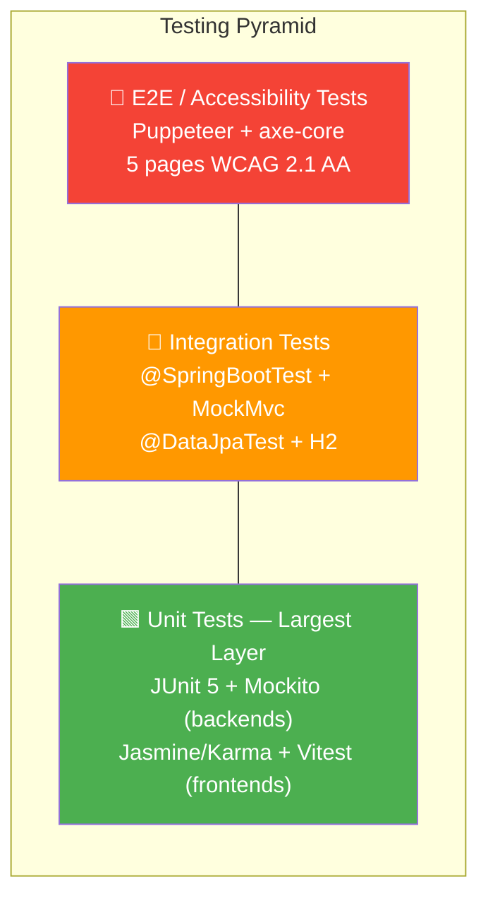
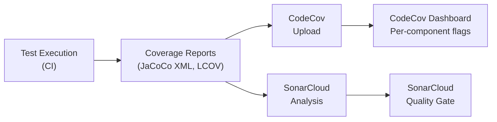
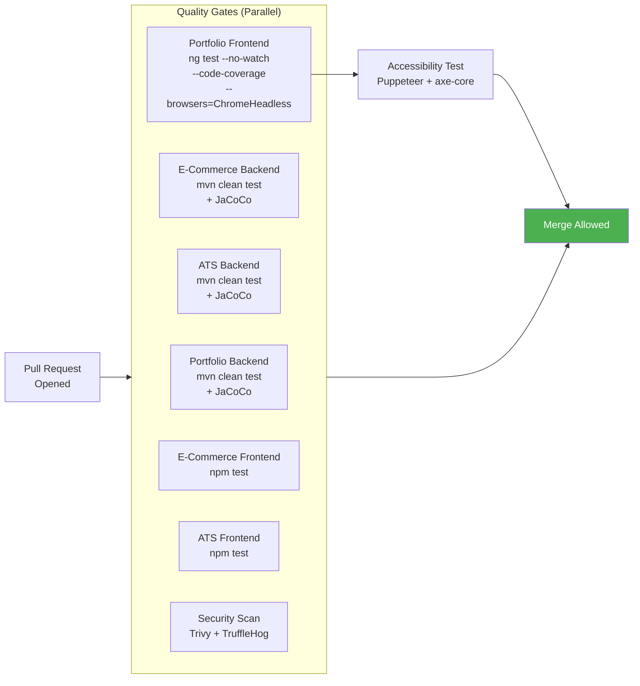

# Testing Strategy

**Author:** Clark Foster
**Last Updated:** March 2026

---

## Table of Contents

1. [Overview](#1-overview)
2. [Testing Pyramid](#2-testing-pyramid)
3. [Unit Tests](#3-unit-tests)
4. [Integration Tests](#4-integration-tests)
5. [End-to-End Tests](#5-end-to-end-tests)
6. [Accessibility Tests](#6-accessibility-tests)
7. [Test Tooling](#7-test-tooling)
8. [Coverage Philosophy](#8-coverage-philosophy)
9. [Example Test Cases](#9-example-test-cases)
10. [Testing in CI/CD](#10-testing-in-cicd)
11. [Static Analysis & Security Testing](#11-static-analysis--security-testing)

---

## 1. Overview

The platform consists of three independently tested applications—Portfolio, E-Commerce, and ATS (Applicant Tracking System)—each with a Spring Boot backend and Angular frontend. Every application follows the same testing philosophy: fast unit tests form the foundation, integration tests validate component wiring, accessibility audits enforce WCAG compliance, and CI/CD gates prevent untested code from reaching production.

### 1.1 Test Inventory at a Glance

| Project | Backend Tests | Frontend Tests | A11y Tests | Total |
|---------|:------------:|:--------------:|:----------:|:-----:|
| **Portfolio** | 13 | 12 | 5 pages | 25 + a11y |
| **E-Commerce** | 7 | 28 | — | 35 |
| **ATS** | 10 | 9 | — | 19 |
| **Total** | **30** | **49** | **5 pages** | **79 + a11y** |

---

## 2. Testing Pyramid



**Principle:** Each layer up the pyramid runs fewer but broader tests. Unit tests are fast (milliseconds), run on every save during development, and catch regressions early. Integration and E2E tests run in CI.

---

## 3. Unit Tests

Unit tests verify individual classes and functions in isolation. External dependencies are mocked.

### 3.1 Backend Unit Tests (Spring Boot / JUnit 5)

All three backends use **JUnit 5** with **Mockito** for dependency injection mocking.

#### Portfolio Backend (13 test classes)

| Layer | Test Class | What It Verifies |
|-------|-----------|------------------|
| Controller | `AuthControllerTest` | Login/register request handling, validation error responses, JWT token issuance |
| Controller | `ProjectControllerTest` | CRUD operations, authentication-gated endpoints |
| Controller | `VersionControllerTest` | Build info and commit SHA reporting |
| Controller | `ContactControllerTest` | Contact form submission, input sanitization, rate limiting |
| Service | `AuthServiceTest` | Password encoding, token generation, user registration logic |
| Service | `ProjectServiceTest` | Business logic for project CRUD, image URL handling |
| Service | `EmailServiceTest` | SMTP integration mocking, template rendering |
| Service | `RefreshTokenServiceTest` | Token rotation, expiry validation |
| Service | `CustomUserDetailsServiceTest` | Spring Security `UserDetails` loading from database |
| Service | `RateLimitingServiceTest` | Bucket4j rate limiter configuration and enforcement |
| Exception | `GlobalExceptionHandlerTest` | Exception-to-HTTP-status mapping, error response body format |
| Repository | `UserRepositoryTest` | JPA query methods, unique constraint enforcement |
| Repository | `ProjectRepositoryTest` | Custom query methods, pagination |

#### E-Commerce Backend (7 test classes)

| Layer | Test Class | What It Verifies |
|-------|-----------|------------------|
| Controller | `AuthControllerTest` | OAuth2/Okta authentication flows |
| Controller | `CheckoutControllerTest` | Cart-to-order checkout request handling |
| Controller | `OrderControllerTest` | Order retrieval, user-scoped access control |
| Security | `UserDetailsServiceImplTest` | User loading and authority mapping |
| Security | `JwtUtilsTest` | Token creation, parsing, expiration, signature validation |
| Service | `CheckoutServiceImplTest` | Order total calculation, inventory validation, transactional behavior |
| Integration | `SpringBootEcommerceApplicationTests` | Application context loads without errors |

#### ATS Backend (10 test classes)

| Layer | Test Class | What It Verifies |
|-------|-----------|------------------|
| Controller | `JobControllerTest` | Job posting CRUD, filtering, pagination |
| Controller | `CandidateControllerTest` | Candidate profile management, status transitions |
| Controller | `TalentPoolControllerTest` | Talent pool search and filtering |
| Controller | `DashboardControllerTest` | Aggregate metrics and dashboard data |
| Controller | `GlobalExceptionHandlerTest` | Error response structure and HTTP status mapping |
| Service | `JobServiceTest` | Job business logic, validation rules |
| Service | `CandidateServiceTest` | Candidate lifecycle management |
| Service | `DashboardServiceTest` | Metric aggregation and computation |
| Service | `ResumeParserServiceTest` | PDF/DOCX parsing via Apache Tika, field extraction |
| Service | `TalentPoolInitializerTest` | Seed data bootstrapping on startup |

### 3.2 Frontend Unit Tests (Angular)

#### Portfolio Frontend — Karma + Jasmine (12 spec files)

| Type | Spec File | What It Verifies |
|------|----------|------------------|
| Component | `app.component.spec.ts` | Root component bootstraps, router outlet renders |
| Component | `home.component.spec.ts` | Terminal loader animation, skills display, featured project cards |
| Component | `navbar.component.spec.ts` | Navigation links render, active route highlighting, mobile menu toggle |
| Component | `footer.component.spec.ts` | Footer links, copyright year, social media icons |
| Component | `projects.component.spec.ts` | Project list rendering, filtering, card layout |
| Component | `credentials.component.spec.ts` | Credential display and formatting |
| Component | `interactive-projects.component.spec.ts` | Interactive demo embedding and routing |
| Component | `login.component.spec.ts` | Form validation, error display, submit handling |
| Component | `contact.component.spec.ts` | Form field validation, submission, success/error messages |
| Service | `contact.service.spec.ts` | HTTP POST to contact API, error handling |
| Service | `auth.service.spec.ts` | JWT storage, login/logout, token refresh calls |
| Service | `project.service.spec.ts` | HTTP GET for project data, caching behavior |

#### E-Commerce Frontend — Vitest (28 spec files)

| Type | Count | Examples |
|------|:-----:|---------|
| Components | 11 | `product-list`, `checkout`, `cart-details`, `order-history`, `login-status`, `search` |
| Services | 6 | `product.service`, `checkout.service`, `cart.service`, `auth.service`, `order-history.service`, `shop-form.service` |
| Models | 8 | `cart-item.model`, `product.model`, `order.model`, `address.model`, `customer.model`, `purchase.model` |
| Guards | 1 | `auth.guard` — route protection logic |
| Utilities | 2 | `auth.interceptor` — token attachment; `shop-validators` — custom form validators |

#### ATS Frontend — Vitest (9 spec files)

| Type | Spec File | What It Verifies |
|------|----------|------------------|
| Component | `app.component.spec.ts` | Root bootstrap and layout rendering |
| Component | `jobs.component.spec.ts` | Job listing display, pagination, filtering |
| Component | `dashboard.component.spec.ts` | Metrics cards, chart rendering |
| Component | `pipeline.component.spec.ts` | Kanban board stages, drag-and-drop interactions |
| Component | `talent.component.spec.ts` | Talent pool table, search, sorting |
| Model | `ats.models.spec.ts` | Interface contracts and factory functions |
| Service | `dashboard.service.spec.ts` | HTTP calls for dashboard metrics |
| Service | `candidate.service.spec.ts` | Candidate CRUD API calls |
| Service | `job.service.spec.ts` | Job CRUD API calls, query parameters |

---

## 4. Integration Tests

Integration tests verify that components work together with real (or in-memory) infrastructure.

### 4.1 Backend Integration Patterns

| Pattern | Annotation | Database | Use Case |
|---------|-----------|----------|----------|
| Full Context | `@SpringBootTest` | H2 in-memory | Verify that the entire application context loads, beans wire correctly, and configuration is valid |
| Web Layer | `@SpringBootTest` + `@AutoConfigureMockMvc` | H2 | End-to-end request handling through the full filter chain (security, rate limiting, validation) without a real HTTP server |
| Repository | `@DataJpaTest` | H2 | Test JPA entity mappings, custom queries, cascade operations, and constraint enforcement in isolation |
| Web Slice | `@WebMvcTest(Controller.class)` | None (mocked) | Test a single controller with mocked services. Verifies request mapping, serialization, and validation annotations |

**H2 Usage:** The E-Commerce and ATS backends declare `com.h2database:h2` with `<scope>test</scope>`. During tests, Spring Boot auto-configures an in-memory H2 database that replaces the production PostgreSQL. The Portfolio backend uses `@DataJpaTest` for repository tests against an embedded database.

### 4.2 Frontend Integration Patterns

Angular component tests use `TestBed` to wire components with their actual templates, directives, and pipes while mocking HTTP calls via `HttpClientTestingModule` (Karma) or `provideHttpClientTesting()` (Vitest). This validates:

- Template binding and rendering logic
- Reactive form validation pipelines
- Router integration (navigation, guards, resolvers)
- Interceptor behavior (token attachment, error handling)
- Component-to-service interaction through dependency injection

---

## 5. End-to-End Tests

### 5.1 Accessibility E2E Tests (Portfolio)

The Portfolio frontend includes automated end-to-end accessibility testing using **Puppeteer** and **axe-core**, configured in `portfolio-frontend/a11y-tests/axe-test.js`.

**Compliance Target:** WCAG 2.1 AA

**Pages Under Test:**

| Page | URL Path | What Is Validated |
|------|---------|-------------------|
| Home | `/` | Landmark structure, heading hierarchy, image alt text, color contrast |
| Contact | `/contact` | Form labels, focus management, error announcement, ARIA attributes |
| Projects | `/projects` | Card heading semantics, link text, keyboard navigation |
| Login | `/login` | Form accessibility, autocomplete attributes, error association |
| Accessibility Statement | `/accessibility` | Page structure, link semantics, content accessibility |

**axe-core Rule Tags:**
- `wcag2a` — WCAG 2.0 Level A
- `wcag2aa` — WCAG 2.0 Level AA
- `wcag21a` — WCAG 2.1 Level A
- `wcag21aa` — WCAG 2.1 Level AA
- `best-practice` — axe-core best-practice rules

**Execution:** Tests launch a headless Chromium instance, navigate to each page, inject axe-core, and fail the test run if any violations are found. The `BASE_URL` is configurable (defaults to `http://localhost:4200`).

### 5.2 Smoke Tests (Post-Deploy)

After every Lambda deployment, the production CI/CD pipeline runs smoke verification:

```
GET https://clarkfoster.com/api/version
```

- Verifies the deployed commit SHA matches the expected commit
- Measures response time
- Validates TLS certificate validity

---

## 6. Accessibility Tests

Accessibility testing is a first-class concern for the Portfolio application.

### 6.1 Tooling

| Tool | Purpose |
|------|---------|
| **axe-core** (`@axe-core/puppeteer`) | Automated WCAG violation detection |
| **Puppeteer** | Headless browser automation for a11y test execution |

### 6.2 CI Integration

The accessibility test job in `pr-validation.yml`:

1. Downloads the built Portfolio frontend artifact from the frontend test job
2. Serves it locally via a static HTTP server
3. Runs `npm run test:a11y` against all 5 pages
4. Fails the PR if any WCAG 2.1 AA violations are detected

This enforces accessibility as a merge gate — no PR can be merged if it introduces an accessibility regression.

---

## 7. Test Tooling

### 7.1 Backend Test Stack

| Tool | Version | Purpose |
|------|---------|---------|
| **JUnit 5** | (via Spring Boot 3.5.13) | Test framework — assertions, lifecycle, parameterized tests |
| **Mockito** | (via Spring Boot 3.5.13) | Mocking framework — `@Mock`, `@InjectMocks`, `when/verify` |
| **AssertJ** | (via Spring Boot 3.5.13) | Fluent assertion library |
| **Hamcrest** | (via Spring Boot 3.5.13) | Matcher-based assertions for MockMvc response validation |
| **Spring Boot Test** | 3.3.5 | `@SpringBootTest`, `@AutoConfigureMockMvc`, `TestRestTemplate` |
| **Spring Security Test** | (via Spring Boot 3.5.13) | `@WithMockUser`, CSRF helpers, OAuth2 test support |
| **Spring WebMvc Test** | 3.3.5 | `@WebMvcTest`, `MockMvc` for controller slice testing |
| **Spring Data JPA Test** | 3.3.5 | `@DataJpaTest`, `TestEntityManager` for repository testing |
| **H2 Database** | (test scope) | In-memory database for integration tests (E-Commerce, ATS) |
| **JaCoCo** | 0.8.14 | Code coverage — generates XML/HTML reports during `mvn test` |
| **Maven Surefire** | (via Spring Boot) | Test execution plugin with Java 21 module compatibility flags |

### 7.2 Frontend Test Stack

| Tool | Used By | Purpose |
|------|---------|---------|
| **Karma** 6.4.0 | Portfolio | Test runner — orchestrates browser-based test execution |
| **Jasmine** 5.6.0 | Portfolio | BDD testing framework — `describe`, `it`, `expect` |
| **karma-chrome-launcher** 3.2.0 | Portfolio | Launches headless Chrome for CI test runs |
| **karma-coverage** 2.2.0 | Portfolio | Istanbul-based code coverage in LCOV format |
| **Vitest** 4.0.8 | E-Commerce, ATS | Modern, fast unit test runner (Vite-native) |
| **jsdom** 28.x | E-Commerce, ATS | DOM simulation for Node-based test execution |
| **Puppeteer** 24.0.0 | Portfolio | Headless Chrome automation for a11y tests |
| **@axe-core/puppeteer** 4.10.0 | Portfolio | axe-core accessibility engine integration with Puppeteer |

### 7.3 Why Two Frontend Test Runners?

The Portfolio frontend uses **Karma + Jasmine** (the traditional Angular test runner), while the E-Commerce and ATS frontends use **Vitest** with Angular's newer `@angular/build:unit-test` builder. This reflects Angular's migration path: Karma was the default prior to Angular 19, and Vitest is the recommended successor. The Portfolio frontend may migrate to Vitest in a future iteration.

---

## 8. Coverage Philosophy

### 8.1 Principles

1. **Coverage is a signal, not a target.** High coverage on trivial code gives a false sense of security. Low coverage on critical paths is a real risk. Coverage metrics guide where to write tests next — not whether a feature is "done."

2. **Test behavior, not implementation.** Tests verify observable outcomes (HTTP response status, rendered DOM, emitted events) rather than internal method calls. This keeps tests stable through refactors.

3. **Critical paths get mandatory coverage.** Authentication, authorization, payment checkout, contact form submission, and resume parsing are non-negotiable. These paths must have both unit and integration coverage.

4. **Infrastructure code is tested through integration.** Repository queries, security filter chains, and Spring configuration are validated via `@SpringBootTest` / `@DataJpaTest` rather than mocking framework internals.

### 8.2 Coverage Tooling

| Layer | Tool | Report Format | Report Path |
|-------|------|:------------:|-------------|
| Java backends | JaCoCo 0.8.14 | XML + HTML | `<project>/target/site/jacoco/jacoco.xml` |
| Portfolio frontend | karma-coverage | LCOV | `portfolio-frontend/coverage/lcov.info` |
| E-Commerce frontend | Vitest | LCOV | `ecommerce-frontend/coverage/lcov.info` |
| ATS frontend | Vitest | LCOV | `ats-frontend/coverage/lcov.info` |

### 8.3 Coverage Reporting Pipeline



- **CodeCov** receives coverage from every test job, tagged with component-specific flags (`portfolio-frontend`, `ats-backend`, etc.) for per-project tracking.
- **SonarCloud** ingests the same reports for its quality gate, providing duplication detection, code smell analysis, and security hotspot identification alongside coverage metrics.

---

## 9. Example Test Cases

### 9.1 Backend — Controller Test (Portfolio `AuthControllerTest`)

```java
@SpringBootTest
@AutoConfigureMockMvc
class AuthControllerTest {

    @Autowired
    private MockMvc mockMvc;

    @Test
    void registerWithValidPayload_returns201() throws Exception {
        mockMvc.perform(post("/api/auth/register")
                .contentType(MediaType.APPLICATION_JSON)
                .content("""
                    {
                      "username": "testuser",
                      "email": "test@example.com",
                      "password": "SecureP@ss123"
                    }
                    """))
                .andExpect(status().isCreated())
                .andExpect(jsonPath("$.message").value("User registered successfully"));
    }

    @Test
    void registerWithDuplicateEmail_returns409() throws Exception {
        // Given: a user already exists with this email
        // When: registering with the same email
        // Then: 409 Conflict with appropriate error message
        mockMvc.perform(post("/api/auth/register")
                .contentType(MediaType.APPLICATION_JSON)
                .content("""
                    {
                      "username": "another",
                      "email": "existing@example.com",
                      "password": "SecureP@ss123"
                    }
                    """))
                .andExpect(status().isConflict());
    }

    @Test
    void loginWithInvalidCredentials_returns401() throws Exception {
        mockMvc.perform(post("/api/auth/login")
                .contentType(MediaType.APPLICATION_JSON)
                .content("""
                    {
                      "email": "wrong@example.com",
                      "password": "wrongpassword"
                    }
                    """))
                .andExpect(status().isUnauthorized());
    }
}
```

### 9.2 Backend — Service Test (ATS `ResumeParserServiceTest`)

```java
@ExtendWith(MockitoExtension.class)
class ResumeParserServiceTest {

    @InjectMocks
    private ResumeParserService resumeParserService;

    @Test
    void parsePdfResume_extractsNameAndEmail() throws Exception {
        // Given: a sample PDF resume file
        byte[] pdfContent = loadTestResource("sample-resume.pdf");
        MockMultipartFile file = new MockMultipartFile(
            "resume", "resume.pdf", "application/pdf", pdfContent);

        // When
        ResumeData result = resumeParserService.parse(file);

        // Then
        assertThat(result.getName()).isNotBlank();
        assertThat(result.getEmail()).contains("@");
    }

    @Test
    void parseUnsupportedFormat_throwsException() {
        MockMultipartFile file = new MockMultipartFile(
            "resume", "resume.exe", "application/octet-stream", new byte[]{});

        assertThatThrownBy(() -> resumeParserService.parse(file))
            .isInstanceOf(UnsupportedFileFormatException.class);
    }
}
```

### 9.3 Backend — Repository Test (E-Commerce `@DataJpaTest`)

```java
@DataJpaTest
class ProductRepositoryTest {

    @Autowired
    private TestEntityManager entityManager;

    @Autowired
    private ProductRepository productRepository;

    @Test
    void findByCategoryId_returnsOnlyMatchingProducts() {
        // Given: products in category 1 and category 2
        ProductCategory electronics = entityManager.persist(
            new ProductCategory("Electronics"));
        entityManager.persist(new Product("Laptop", electronics, 999.99));
        entityManager.persist(new Product("Phone", electronics, 599.99));

        // When
        Page<Product> result = productRepository.findByCategoryId(
            electronics.getId(), PageRequest.of(0, 10));

        // Then
        assertThat(result.getContent()).hasSize(2);
        assertThat(result.getContent())
            .extracting(Product::getName)
            .containsExactlyInAnyOrder("Laptop", "Phone");
    }
}
```

### 9.4 Frontend — Component Test (Portfolio `ContactComponent`)

```typescript
describe('ContactComponent', () => {
  let component: ContactComponent;
  let fixture: ComponentFixture<ContactComponent>;
  let contactService: jasmine.SpyObj<ContactService>;

  beforeEach(async () => {
    contactService = jasmine.createSpyObj('ContactService', ['sendMessage']);

    await TestBed.configureTestingModule({
      imports: [ContactComponent, ReactiveFormsModule],
      providers: [
        { provide: ContactService, useValue: contactService }
      ]
    }).compileComponents();

    fixture = TestBed.createComponent(ContactComponent);
    component = fixture.componentInstance;
    fixture.detectChanges();
  });

  it('should disable submit button when form is invalid', () => {
    const submitButton = fixture.nativeElement
      .querySelector('button[type="submit"]');
    expect(submitButton.disabled).toBeTrue();
  });

  it('should call ContactService on valid submission', () => {
    contactService.sendMessage.and.returnValue(of({ success: true }));

    component.contactForm.setValue({
      name: 'Test User',
      email: 'test@example.com',
      message: 'Hello, this is a test message.'
    });
    component.onSubmit();

    expect(contactService.sendMessage).toHaveBeenCalledWith({
      name: 'Test User',
      email: 'test@example.com',
      message: 'Hello, this is a test message.'
    });
  });

  it('should display success message after submission', fakeAsync(() => {
    contactService.sendMessage.and.returnValue(of({ success: true }));
    component.contactForm.setValue({
      name: 'Test', email: 'a@b.com', message: 'msg'
    });

    component.onSubmit();
    tick();
    fixture.detectChanges();

    const successMsg = fixture.nativeElement.querySelector('.success-message');
    expect(successMsg).toBeTruthy();
  }));
});
```

### 9.5 Frontend — Service Test (E-Commerce `CartService`)

```typescript
describe('CartService', () => {
  let service: CartService;

  beforeEach(() => {
    TestBed.configureTestingModule({});
    service = TestBed.inject(CartService);
  });

  it('should add item to empty cart', () => {
    const product = { id: 1, name: 'Widget', unitPrice: 9.99 };

    service.addToCart(new CartItem(product));

    expect(service.cartItems.length).toBe(1);
    expect(service.totalPrice.value).toBeCloseTo(9.99);
  });

  it('should increment quantity for duplicate item', () => {
    const product = { id: 1, name: 'Widget', unitPrice: 9.99 };
    const cartItem = new CartItem(product);

    service.addToCart(cartItem);
    service.addToCart(cartItem);

    expect(service.cartItems.length).toBe(1);
    expect(service.cartItems[0].quantity).toBe(2);
    expect(service.totalPrice.value).toBeCloseTo(19.98);
  });

  it('should compute total quantity across all items', () => {
    service.addToCart(new CartItem({ id: 1, unitPrice: 10 }));
    service.addToCart(new CartItem({ id: 2, unitPrice: 20 }));

    expect(service.totalQuantity.value).toBe(2);
  });
});
```

### 9.6 Accessibility Test (Portfolio `axe-test.js`)

```javascript
const { AxePuppeteer } = require('@axe-core/puppeteer');
const puppeteer = require('puppeteer');

const BASE_URL = process.env.BASE_URL || 'http://localhost:4200';

const pages = [
  { name: 'Home', path: '/' },
  { name: 'Contact', path: '/contact' },
  { name: 'Projects', path: '/projects' },
  { name: 'Login', path: '/login' },
  { name: 'Accessibility', path: '/accessibility' }
];

describe('WCAG 2.1 AA Compliance', () => {
  let browser;

  beforeAll(async () => {
    browser = await puppeteer.launch({ headless: 'new' });
  });

  afterAll(async () => {
    await browser.close();
  });

  pages.forEach(({ name, path }) => {
    it(`${name} page has no WCAG 2.1 AA violations`, async () => {
      const page = await browser.newPage();
      await page.goto(`${BASE_URL}${path}`, { waitUntil: 'networkidle0' });

      const results = await new AxePuppeteer(page)
        .withTags(['wcag2a', 'wcag2aa', 'wcag21a', 'wcag21aa', 'best-practice'])
        .analyze();

      expect(results.violations).toEqual([]);
    });
  });
});
```

---

## 10. Testing in CI/CD

Testing is embedded at every stage of the CI/CD pipeline. No code reaches production without passing all gates.

### 10.1 Pull Request Validation



**Failure behavior:** Any single failing job blocks the PR from merging. This is enforced through GitHub branch protection rules requiring all status checks to pass.

### 10.2 Production Deployment

On merge to `main`, all tests re-run before deployment:

| Stage | Tests Run | Failure Consequence |
|-------|----------|---------------------|
| **1. Quality Gates** | All 6 backend/frontend test suites in parallel | Deployment aborted — no infrastructure changes, no images built |
| **2. Terraform** | `terraform validate` + `terraform plan` | Infrastructure changes blocked |
| **3. Docker Build** | Trivy image scan (CRITICAL/HIGH) | SARIF uploaded to GitHub Security; image not deployed |
| **4. Lambda Deploy** | — | Update Lambda function code + publish new version |
| **5. Smoke Tests** | `GET /api/version` — verify commit SHA, response time, TLS cert | Alert/manual rollback |

### 10.3 Reusable Test Workflow

Both pipelines call `reusable-test.yml` parameterized per component:

**Java projects:**
```yaml
- Setup JDK 25 + Maven cache
- mvn clean test
- Generate JaCoCo coverage reports
- Upload JAR artifact
- Upload coverage to CodeCov (flagged per-component)
```

**Node projects:**
```yaml
- Setup Node 20 + npm cache
- npm ci
- npm run lint
- npx ng test (with project-specific args)
- npm run build
- Upload dist artifact
- Upload coverage to CodeCov (flagged per-component)
```

### 10.4 Concurrency Controls

| Pipeline | Concurrency Key | Cancel In-Progress |
|----------|----------------|:------------------:|
| PR Validation | `pr-${{ pull_request.number }}` | Yes — new pushes cancel stale runs |
| Production Deploy | `deploy-production` | No — deployments are serialized, never cancelled |

### 10.5 Local Testing

Developers can run the full test suite locally before pushing:

```bash
# Run all tests across all 6 projects
make test

# Run a single backend's tests
cd portfolio-backend && mvn test

# Run a single frontend's tests
cd portfolio-frontend && npm test

# Run accessibility tests (requires frontend running on :4200)
cd portfolio-frontend && npm run test:a11y

# Run frontend tests in CI mode (headless, coverage)
cd portfolio-frontend && npm run test:ci
```

---

## 11. Static Analysis & Security Testing

Testing extends beyond functional correctness into code quality and security.

### 11.1 SonarCloud

**Configuration:** `sonar-project.properties`

| Setting | Value |
|---------|-------|
| Project Key | `clark22134_MyPortfolioWebsite` |
| Source Paths | `*/src/main/java`, `*/src/app` (across all 3 projects) |
| Test Paths | `*/src/test/java`, `**/*.spec.ts` |
| Coverage Reports | JaCoCo XML (backends) + LCOV (frontends) |
| Exclusions | `node_modules`, `dist`, `target`, `*.jar`, `*.spec.ts` (from sources) |

SonarCloud analyzes every push to `main` as part of the production deployment pipeline, providing:
- Code coverage metrics
- Duplicate code detection
- Code smell identification
- Security hotspot review
- Quality gate pass/fail status

### 11.2 Security Scanning

| Tool | Scope | Trigger | Threshold |
|------|-------|---------|-----------|
| **Trivy** (filesystem) | Source code + dependencies | Every PR + deploy | CRITICAL, HIGH |
| **Trivy** (image) | Built Docker images | Production deploy | CRITICAL, HIGH → SARIF to GitHub |
| **TruffleHog** | Git history | Every PR + deploy | Verified secrets only |
| **npm audit** | Frontend dependencies | PR validation | Moderate and above |
| **OWASP Dependency-Check** | Backend Maven dependencies | PR validation | CVSS ≥ 7 |
| **CodeRabbit** | Code changes | Every PR | AI-driven review comments |

---

*This document covers the testing strategy across all three applications and their shared CI/CD infrastructure. For deployment pipeline details, see [DEVOPS_INFRASTRUCTURE.md](DEVOPS_INFRASTRUCTURE.md). For architecture and component diagrams, see [ARCHITECTURE.md](ARCHITECTURE.md).*
