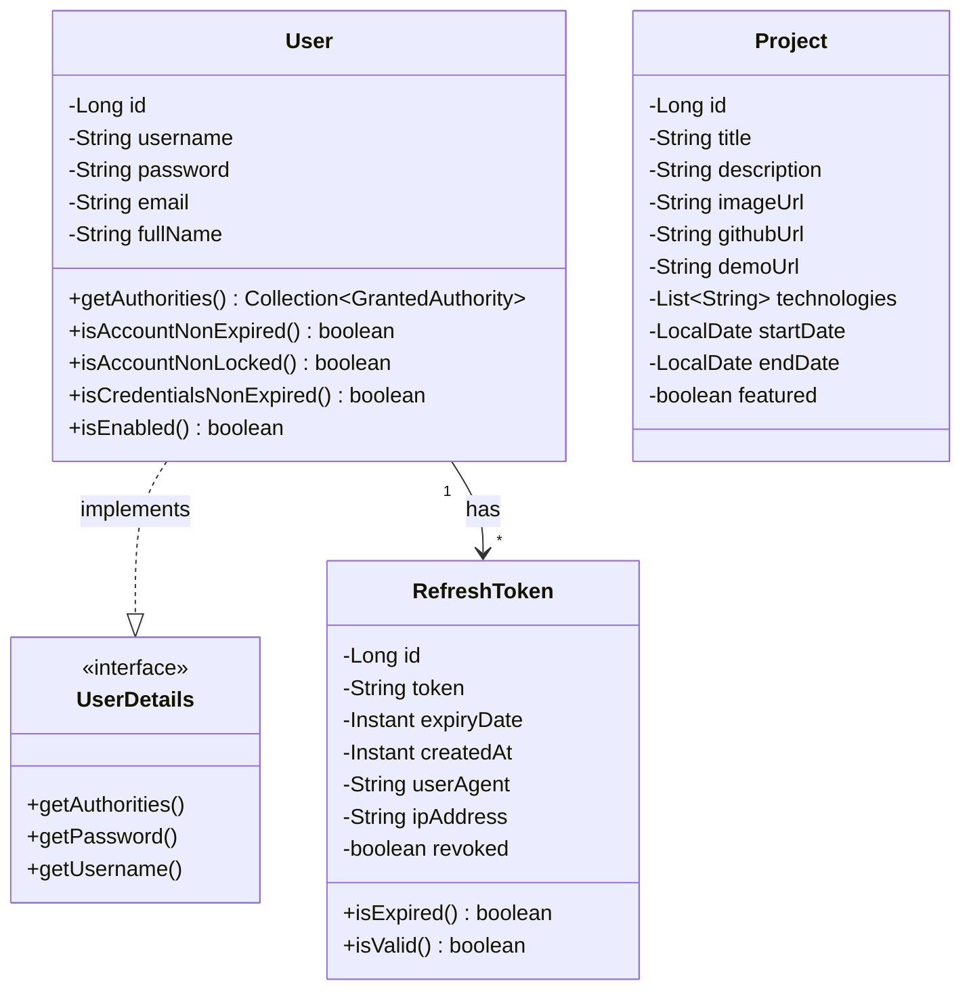
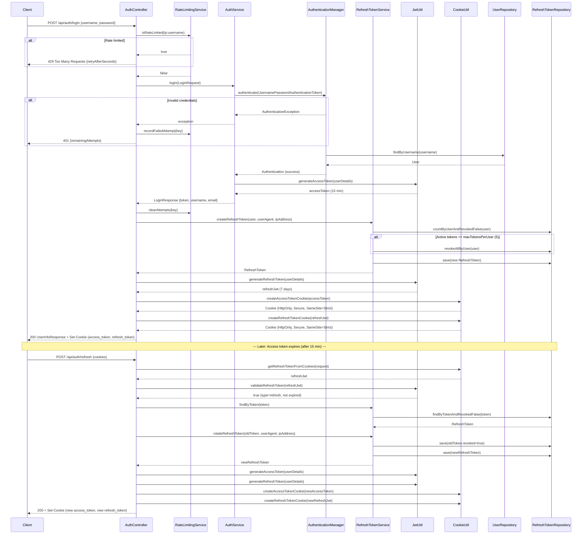
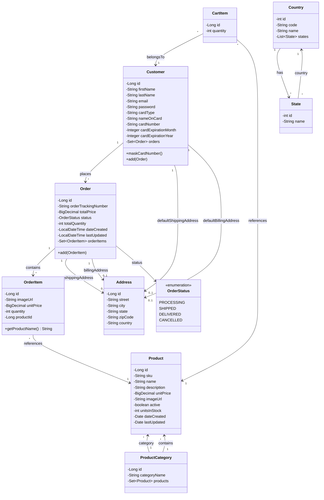
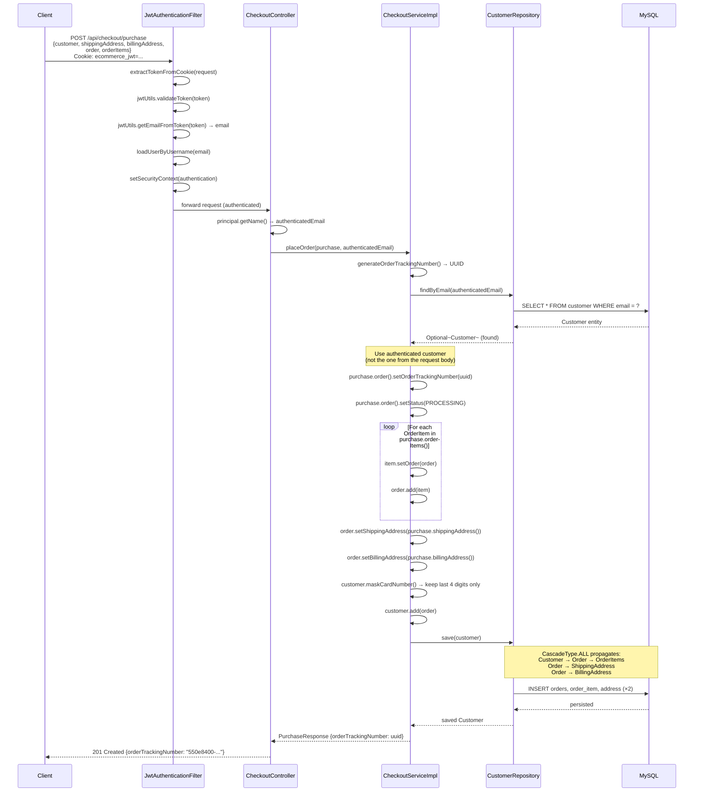
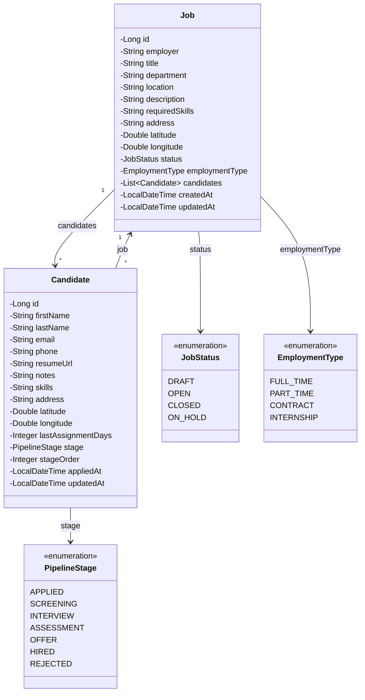
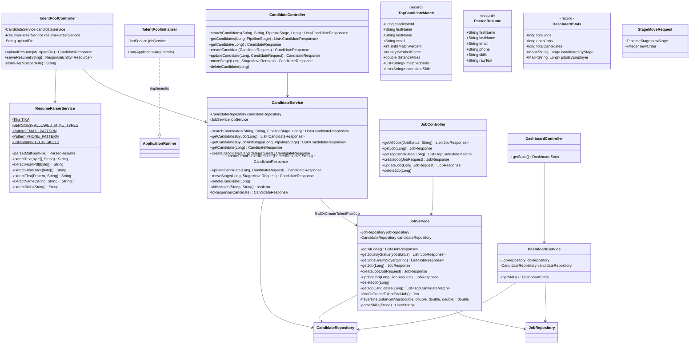
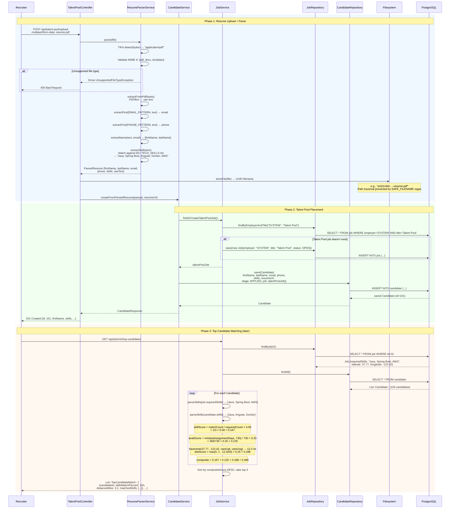

# UML Diagrams

---

## 1. Portfolio Website

### 1.1 Class Diagram — Domain Models

### 1.2 Class Diagram — Services and Security

```mermaid
classDiagram
    class AuthService {
        -UserRepository userRepository
        -PasswordEncoder passwordEncoder
        -JwtUtil jwtUtil
        -AuthenticationManager authenticationManager
        -CustomUserDetailsService userDetailsService
        +login(LoginRequest) LoginResponse
        +register(RegisterRequest) User
        +findByUsername(String) User
        -validateUniqueCredentials(RegisterRequest)
    }

    class RefreshTokenService {
        -RefreshTokenRepository refreshTokenRepository
        -UserRepository userRepository
        -long refreshTokenExpirationMs
        -int maxTokensPerUser
        +createRefreshToken(User, String, String) RefreshToken
        +findByToken(String) Optional~RefreshToken~
        +validateRefreshToken(RefreshToken) boolean
        +revokeToken(RefreshToken)
        +revokeAllUserTokens(User)
        +rotateRefreshToken(RefreshToken, String, String) RefreshToken
        +cleanupExpiredTokens()
        -enforceMaxTokensPerUser(User)
    }

    class ProjectService {
        -ProjectRepository projectRepository
        +getAllProjects() List~Project~
        +getFeaturedProjects() List~Project~
        +getProjectById(Long) Optional~Project~
        +createProject(Project) Project
        +updateProject(Long, Project) Project
        +deleteProject(Long)
    }

    class EmailService {
        -JavaMailSender mailSender
        -String contactEmail
        -String fromEmail
        +sendContactEmail(ContactRequest)
        -createContactMessage(ContactRequest) SimpleMailMessage
        -buildEmailBody(ContactRequest) String
    }

    class JwtUtil {
        -String secret
        -Long accessTokenExpiration
        -Long refreshTokenExpiration
        -SecretKey signingKey
        +generateAccessToken(UserDetails) String
        +generateRefreshToken(UserDetails) String
        +extractUsername(String) String
        +extractTokenType(String) String
        +validateAccessToken(String, UserDetails) boolean
        +validateRefreshToken(String) boolean
    }

    class RateLimitingService {
        -Map~String, AttemptInfo~ attemptCache
        +isRateLimited(String) boolean
        +recordFailedAttempt(String)
        +clearAttempts(String)
        +getRemainingAttempts(String) int
        +getSecondsUntilUnlock(String) long
    }

    class CookieUtil {
        -Long accessTokenExpirationMs
        -Long refreshTokenExpirationMs
        -boolean secureCookie
        -String cookieDomain
        +createAccessTokenCookie(String) Cookie
        +createRefreshTokenCookie(String) Cookie
        +addCookieWithSameSite(HttpServletResponse, Cookie, String)
        +getAccessTokenFromCookies(HttpServletRequest) Optional~String~
        +getRefreshTokenFromCookies(HttpServletRequest) Optional~String~
        +createClearAccessTokenCookie() Cookie
        +createClearRefreshTokenCookie() Cookie
    }

    class JwtRequestFilter {
        -CustomUserDetailsService userDetailsService
        -JwtUtil jwtUtil
        -CookieUtil cookieUtil
        #doFilterInternal(HttpServletRequest, HttpServletResponse, FilterChain)
        -extractJwt(HttpServletRequest) Optional~String~
        -authenticateIfValid(String, HttpServletRequest)
    }
    JwtRequestFilter --|> OncePerRequestFilter : extends

    class AuthController {
        +login(LoginRequest, HttpServletRequest, HttpServletResponse) ResponseEntity
        +refreshToken(HttpServletRequest, HttpServletResponse) ResponseEntity
        +logout(HttpServletRequest, HttpServletResponse) ResponseEntity
        +getCurrentUser(UserDetails) ResponseEntity
        +logoutAllDevices(UserDetails, HttpServletResponse) ResponseEntity
        +register(RegisterRequest, HttpServletRequest) ResponseEntity
    }

    class ProjectController {
        +getAllProjects() ResponseEntity
        +getFeaturedProjects() ResponseEntity
        +getProjectById(Long) ResponseEntity
        +createProject(Project) ResponseEntity
        +updateProject(Long, Project) ResponseEntity
        +deleteProject(Long) ResponseEntity
    }

    class ContactController {
        +sendContactEmail(ContactRequest) ResponseEntity
    }

    AuthController --> AuthService
    AuthController --> RateLimitingService
    AuthController --> JwtUtil
    AuthController --> CookieUtil
    AuthController --> RefreshTokenService

    ProjectController --> ProjectService

    ContactController --> EmailService

    JwtRequestFilter --> JwtUtil
    JwtRequestFilter --> CookieUtil

    AuthService --> UserRepository
    RefreshTokenService --> RefreshTokenRepository
    ProjectService --> ProjectRepository
```

### 1.3 Sequence Diagram — Login with Refresh Token Rotation

### 1.4 Relationships

| Relationship | Type | Description |
|-------------|------|-------------|
| `User` → `RefreshToken` | One-to-Many | A user can have up to 5 active (non-revoked) refresh tokens, one per device/session. Enforced programmatically by `RefreshTokenService.enforceMaxTokensPerUser()`. |
| `User` implements `UserDetails` | Interface | Spring Security integration. The User entity doubles as the security principal. `getAuthorities()` returns an empty list (no role-based access — all authenticated users have equal access). |
| `AuthController` → `RateLimitingService` | Dependency | Login and registration endpoints check the in-memory rate limiter before processing. Keyed by `clientIp:username`. 5 attempts per 15-minute window, 30-minute lockout. |
| `JwtRequestFilter` → `CookieUtil` | Dependency | The filter extracts JWTs from cookies first (primary path), falling back to the `Authorization: Bearer` header. Cookie-first extraction supports the SPA's HTTP-only cookie auth model. |
| `RefreshTokenService` → `RefreshTokenRepository` | Dependency | Token rotation is the core security operation: the old refresh token is revoked and a new one is issued atomically within a `@Transactional` method. A scheduled job (`@Scheduled cron`) cleans up expired tokens at 2 AM daily. |

### 1.5 Design Patterns

| Pattern | Where | Purpose |
|---------|-------|---------|
| **Repository** | `UserRepository`, `ProjectRepository`, `RefreshTokenRepository` | Spring Data JPA repositories provide standard CRUD and custom query methods, decoupling persistence from business logic. |
| **Filter Chain** | `JwtRequestFilter` extends `OncePerRequestFilter` | Intercepts every HTTP request to extract and validate JWT tokens before the request reaches the controller. Part of Spring Security's filter chain, registered before `UsernamePasswordAuthenticationFilter`. |
| **Token Rotation** | `RefreshTokenService.rotateRefreshToken()` | Each refresh token is single-use. When used, the old token is revoked and a new one is created in the same transaction. If a revoked token is reused, it signals potential theft — the system can revoke all tokens for that user. |
| **Sliding Window Rate Limiting** | `RateLimitingService` | In-memory `ConcurrentHashMap` tracks failed login attempts per key (IP + username). After 5 failures within 15 minutes, the key is locked for 30 minutes. Prevents brute-force attacks without external dependencies (Redis, etc.). |
| **Factory Method** | `ApiResponse.success()`, `ApiResponse.error()`, `AuthErrorResponse.of()` | Static factory methods on response DTOs provide a consistent, self-documenting API response structure without requiring constructors with positional arguments. |
| **Adapter** | `User` implements `UserDetails` | The domain entity adapts to Spring Security's `UserDetails` interface, avoiding a separate security-specific user class and the mapping overhead between them. |

---

## 2. E-Commerce Platform

### 2.1 Class Diagram — Domain Models

### 2.2 Class Diagram — Services and Controllers

```mermaid
classDiagram
    class CheckoutService {
        <<interface>>
        +placeOrder(Purchase, String) PurchaseResponse
    }

    class CheckoutServiceImpl {
        -CustomerRepository customerRepository
        +placeOrder(Purchase, String) PurchaseResponse
        -generateOrderTrackingNumber() String
    }
    CheckoutServiceImpl ..|> CheckoutService : implements

    class CartService {
        <<interface>>
        +getCart(String) List~CartItemDto~
        +saveCart(String, List~CartItemDto~) List~CartItemDto~
    }

    class CartServiceImpl {
        -CartItemRepository cartItemRepository
        -CustomerRepository customerRepository
        -ProductRepository productRepository
        +getCart(String) List~CartItemDto~
        +saveCart(String, List~CartItemDto~) List~CartItemDto~
    }
    CartServiceImpl ..|> CartService : implements

    class AuthController {
        -AuthenticationManager authenticationManager
        -CustomerRepository customerRepository
        -PasswordEncoder passwordEncoder
        -JwtUtils jwtUtils
        -CookieUtil cookieUtil
        +login(LoginRequest, HttpServletResponse) ResponseEntity~AuthResponse~
        +register(RegisterRequest, HttpServletResponse) ResponseEntity
        +getProfile(Principal) ResponseEntity~CustomerProfileResponse~
        +logout(HttpServletResponse) ResponseEntity~Void~
    }

    class CheckoutController {
        -CheckoutService checkoutService
        +placeOrder(Purchase, Principal) PurchaseResponse
    }

    class CartController {
        -CartService cartService
        +getCart(Principal) List~CartItemDto~
        +saveCart(Principal, List~CartItemDto~) List~CartItemDto~
    }

    class OrderController {
        -OrderRepository orderRepository
        +getOrderHistory(Principal) List~Order~
    }

    class JwtUtils {
        -String jwtSecret
        -long jwtExpirationMs
        -SecretKey signingKey
        +generateToken(String) String
        +getEmailFromToken(String) String
        +validateToken(String) boolean
    }

    class JwtAuthenticationFilter {
        -JwtUtils jwtUtils
        -UserDetailsService userDetailsService
        #doFilterInternal(HttpServletRequest, HttpServletResponse, FilterChain)
        -extractTokenFromCookie(HttpServletRequest) String
    }
    JwtAuthenticationFilter --|> OncePerRequestFilter : extends

    class UserDetailsServiceImpl {
        -CustomerRepository customerRepository
        +loadUserByUsername(String) UserDetails
    }
    UserDetailsServiceImpl ..|> UserDetailsService : implements

    class CookieUtil {
        -boolean secureCookie
        -String sameSite
        +addJwtCookie(HttpServletResponse, String, int)
        +clearJwtCookie(HttpServletResponse)
    }

    class MyDataRestConfig {
        -EntityManager entityManager
        +configureRepositoryRestConfiguration(RepositoryRestConfiguration, CorsRegistry)
    }
    MyDataRestConfig ..|> RepositoryRestConfigurer : implements

    class Purchase {
        <<record>>
        +Customer customer
        +Address shippingAddress
        +Address billingAddress
        +Order order
        +Set~OrderItem~ orderItems
    }

    class PurchaseResponse {
        <<record>>
        +String orderTrackingNumber
    }

    CheckoutController --> CheckoutService
    CartController --> CartService
    OrderController --> OrderRepository
    AuthController --> JwtUtils
    AuthController --> CookieUtil
    AuthController --> CustomerRepository

    JwtAuthenticationFilter --> JwtUtils
    JwtAuthenticationFilter --> UserDetailsServiceImpl

    CheckoutServiceImpl --> CustomerRepository
    CartServiceImpl --> CartItemRepository
    CartServiceImpl --> CustomerRepository
    CartServiceImpl --> ProductRepository
```

### 2.3 Sequence Diagram — Checkout (Place Order)

### 2.4 Relationships

| Relationship | Type | JPA Mapping | Description |
|-------------|------|-------------|-------------|
| `ProductCategory` → `Product` | One-to-Many | `@OneToMany(cascade=ALL, mappedBy="category")` | A category contains many products. Cascade ALL means deleting a category removes its products. |
| `Product` → `ProductCategory` | Many-to-One | `@ManyToOne @JoinColumn(name="category_id")` | Each product belongs to exactly one category. |
| `Customer` → `Order` | One-to-Many | `@OneToMany(mappedBy="customer", cascade=ALL)` | A customer accumulates orders over time. The `add(Order)` method sets the bidirectional link. |
| `Order` → `OrderItem` | One-to-Many | `@OneToMany(cascade=ALL, mappedBy="order")` | An order contains line items. Each item snapshots the product's price and image at purchase time — the item stores `productId`, `unitPrice`, and `imageUrl` directly rather than relying solely on the Product FK. |
| `OrderItem` → `Product` | Many-to-One (read-only) | `@ManyToOne(fetch=LAZY) @JoinColumn(insertable=false, updatable=false)` | Used only to resolve `getProductName()` via `@JsonProperty`. The FK is stored in the `productId` column, kept separate from the JPA relationship to allow order items to exist independently of product changes. |
| `Customer` → `Address` | One-to-One (×2) | `@OneToOne(cascade=ALL) @JoinColumn` | Separate default shipping and billing addresses. Cascade ALL so creating a customer with addresses persists them in one save. |
| `Order` → `Address` | One-to-One (×2) | `@OneToOne(cascade=ALL) @JoinColumn` | Each order captures its own shipping and billing addresses at order time, independent of the customer's default addresses. |
| `CartItem` → `Customer`, `Product` | Many-to-One (×2) | `@ManyToOne(fetch=LAZY) @JoinColumn` | Lightweight join table linking customers to products with a quantity. Replaced entirely on each `saveCart()` call (delete all, insert new). |
| `Country` → `State` | One-to-Many | `@OneToMany(mappedBy="country")` | Reference data. Exposed read-only via Spring Data REST. |

### 2.5 Design Patterns

| Pattern | Where | Purpose |
|---------|-------|---------|
| **Repository** | `CustomerRepository`, `ProductRepository`, `OrderRepository`, `CartItemRepository` | Spring Data JPA repositories. `OrderRepository` uses a custom `@Query` with `JOIN FETCH` to eagerly load order items, products, and both addresses in a single query — avoids N+1 on the order history page. |
| **Data Transfer Object** | `Purchase`, `PurchaseResponse`, `CartItemDto`, `LoginRequest`, `RegisterRequest`, `CustomerProfileResponse` | Java records serve as immutable DTOs. `Purchase` aggregates the full checkout payload (customer, addresses, order, items) into one request body. `CartItemDto` provides a flat view of cart items without exposing JPA entities to the API. |
| **Service Layer** | `CheckoutService`/`CheckoutServiceImpl`, `CartService`/`CartServiceImpl` | Interface + implementation separation. `CheckoutServiceImpl` contains the order assembly logic (tracking number generation, card masking, cascade save). `CartServiceImpl` handles the delete-all-then-insert cart replacement strategy. |
| **Template Method (Spring Data REST)** | `MyDataRestConfig` implements `RepositoryRestConfigurer` | Overrides the configuration hook to disable write operations on reference data (products, categories, countries, states) while letting Spring auto-generate the read endpoints. Exposes entity IDs in responses, which Angular needs for routing. |
| **Strategy (Authentication)** | `JwtAuthenticationFilter` | Cookie-first, header-fallback JWT extraction strategy. Tries `ecommerce_jwt` cookie first (SPA use case), then `Authorization: Bearer` header (API client use case). Gracefully handles stale cookies by proceeding unauthenticated. |
| **Aggregate Root** | `Customer.save()` cascades to `Order` → `OrderItem` + `Address` | The `Customer` entity acts as the aggregate root for the checkout operation. A single `customerRepository.save(customer)` persists the entire object graph (order, items, addresses) in one transaction — JPA cascade handles the inserts. |

---

## 3. HireFlow — Applicant Tracking System

### 3.1 Class Diagram — Domain Models

### 3.2 Class Diagram — Services, Controllers, and DTOs

### 3.3 Sequence Diagram — Resume Upload → Candidate Creation → Top Match Scoring

### 3.4 Relationships

| Relationship | Type | JPA Mapping | Description |
|-------------|------|-------------|-------------|
| `Job` → `Candidate` | One-to-Many | `@OneToMany(mappedBy="job", cascade=ALL, orphanRemoval=true)` | A job has many candidates. `orphanRemoval=true` means removing a candidate from the list deletes it from the database. `cascade=ALL` means deleting a job deletes all its candidates. |
| `Candidate` → `Job` | Many-to-One | `@ManyToOne(fetch=LAZY) @JoinColumn(name="job_id", nullable=false)` | Every candidate must be assigned to a job. Talent pool candidates are assigned to a synthetic "SYSTEM / Talent Pool" job entity rather than using a nullable FK — this avoids null checks throughout the codebase. |
| `CandidateService` → `JobService` | Dependency | Constructor injection | `CandidateService` depends on `JobService` for `findOrCreateTalentPoolJob()` when creating candidates from parsed resumes. This creates a unidirectional dependency: candidate operations can look up jobs, but job operations don't depend on the candidate service (except through the repository). |
| `TalentPoolController` → `ResumeParserService` + `CandidateService` | Dependency | Constructor injection | The controller orchestrates two services: parse the resume, then create the candidate. The controller — not a service — handles file storage, keeping the parse and persistence services focused and testable in isolation. |

### 3.5 Design Patterns

| Pattern | Where | Purpose |
|---------|-------|---------|
| **Repository** | `JobRepository`, `CandidateRepository` | Spring Data JPA repositories with custom query methods. `CandidateRepository.search()` uses a native query with conditional `WHERE` clauses (null-safe filtering) to support the multi-parameter search endpoint. `JobRepository.countJobsGroupedByEmployer()` uses JPQL aggregation for the dashboard. |
| **DTO / Response Mapping** | `JobRequest`→`Job`, `Job`→`JobResponse`, `Candidate`→`CandidateResponse`, `ParsedResume` | Request and response DTOs decouple the API contract from the JPA entities. The `toResponse()` methods in services perform the mapping. `ParsedResume` is a record that captures the parser's output without any JPA coupling. `JobResponse` adds a computed `candidateCount` field that doesn't exist on the entity. |
| **Strategy (Resume Parsing)** | `ResumeParserService.extractText()` | MIME type determines the extraction strategy: PDF → PDFBox, DOCX → Apache POI, TXT → raw bytes. The `parse()` method orchestrates: detect type → extract text → regex extraction → skill matching. Each extraction method is a private implementation of one branch. |
| **Null Object (Talent Pool)** | `JobService.findOrCreateTalentPoolJob()` | Instead of allowing candidates without a job (nullable FK), a sentinel "Talent Pool" job with employer "SYSTEM" always exists. Created on startup by `TalentPoolInitializer` (implements `ApplicationRunner`). This avoids null job references across the entire candidate pipeline. |
| **Composite Scoring** | `JobService.getTopCandidates()` | Multi-factor ranking algorithm: skill overlap (50%), availability (25%), proximity (25%). Each factor is normalized to [0, 1] before weighting. Haversine distance is capped at 50 miles (beyond that, proximity score = 0). Results are sorted and truncated to top 5. |
| **Optimistic Update** | Frontend `PipelineComponent` + `PATCH /api/candidates/{id}/stage` | The drag-and-drop Kanban UI moves the card immediately (optimistic), then sends the `StageMoveRequest` to the backend. The `moveStage()` service method updates `stage` and `stageOrder` atomically. If the API call fails, the frontend rolls back the card to its original column. |
| **Builder** | All entities and DTOs annotated `@Builder` (Lombok) | Entities and request/response objects use the builder pattern (via Lombok `@Builder`) for readable construction without telescoping constructors. Particularly useful in `CandidateService.createFromParsedResume()` which constructs a Candidate from scattered ParsedResume fields. |

---

## 4. Cross-System Patterns

These patterns appear across all three projects and reflect shared architectural decisions.

| Pattern | Applied Across | Rationale |
|---------|----------------|-----------|
| **Layered Architecture** (Controller → Service → Repository → Entity) | All three backends | Enforces separation of concerns. Controllers handle HTTP mapping and validation. Services contain business logic. Repositories handle persistence. No controller directly accesses the database; no repository contains business rules. |
| **Stateless JWT Authentication** | Portfolio (access + refresh), E-Commerce (single token) | Eliminates server-side session storage. The backend validates tokens on every request via a filter — no session replication needed across instances. Portfolio uses dual tokens (short access + long refresh) for tighter security; E-Commerce uses a single 1-hour token for simplicity. |
| **HTTP-Only Cookies** | Portfolio (`access_token`, `refresh_token`), E-Commerce (`ecommerce_jwt`) | Prevents JavaScript from reading tokens (XSS mitigation). Both use `SameSite` attributes (Strict for Portfolio, Lax for E-Commerce) and `Secure` flag in production. |
| **Filter-Based Security** | All three (Portfolio: `JwtRequestFilter`, E-Commerce: `JwtAuthenticationFilter`, ATS: none — demo mode) | Spring Security's filter chain runs before controllers. The JWT filter extracts, validates, and sets the security context. ATS skips this for demo access, but the security filter chain is still configured (CORS, CSRF disabled, stateless sessions). |
| **Record DTOs** | All three backends | Java records provide immutable, concise DTOs with automatic `equals()`, `hashCode()`, and `toString()`. Used for request payloads (`LoginRequest`, `Purchase`, `StageMoveRequest`), response payloads (`PurchaseResponse`, `ParsedResume`, `DashboardStats`), and API wrappers (`ApiResponse<T>`). |
| **Global Exception Handler** | All three backends (`@RestControllerAdvice`) | Centralizes error response formatting. Maps `MethodArgumentNotValidException` → 400, `ResourceNotFoundException` → 404, `AuthenticationException` → 401, `IOException` → 500. Returns consistent `Map<String, String>` error shapes. |
| **Multi-Stage Docker Build** | All six services | Stage 1 (Maven or Node) compiles the application. Stage 2 (JRE Alpine or Nginx Alpine) runs it. Keeps production images small — no compilers, build tools, or source code in the final image. |
| **Sidecar Database** | E-Commerce (MySQL), ATS (PostgreSQL) | Database containers run in the same ECS task as the backend, communicating over `localhost`. Avoids managed database costs and cross-network latency. Tradeoff: no managed backups or failover. |
